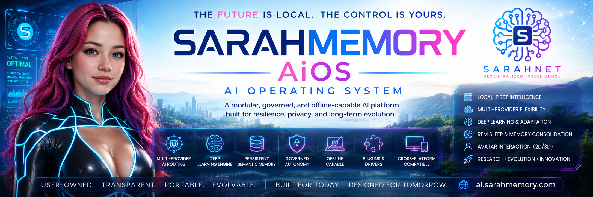

# **SarahMemory AI Operating System (AiOS)**  
### **Version 9.0.0 — Developer & Functional Release**

---
## **📌 Project Metadata**

| Field | Value |
|-------|--------|
| **R&D Start Date** | February 21, 2025 |
| **First Release** | December 05, 2025 |
| **Last Update** | June 12, 2026 |
| **Author** | Brian Lee Baros |
| **License** | © 2025–2026 Brian Lee Baros. All Rights Reserved. |
| **Primary Languages** | Python 3.11–3.13.12 |
| **Development Environment** | Windows 10, VS Code, AMD FX‑8350, Ryzen 3, Nvidia 3060, Radeon Vega, Galaxy S20+, iPhone 14 |
| **Important Notice** | Project files are updated quite often; it is highly recommended to check back often for new files and fixes to core files. Just because something might not fully work today doesn't mean it won't fully work tomorrow because this project is live, active and ongoing development. |

---
# **🚀 Vision: Decentralized Intelligence, Owned by the User**

**SarahMemory AiOS** is a **local‑first, decentralized AI Operating System** designed to return ownership, control, and autonomy to the individual.

In a world where AI is increasingly centralized, monetized, and surveilled, SarahMemory offers a different path:

> **Run your own AI.  
> Own your own data.  
> Control your own system.**

SarahMemory is not a chatbot.  
It is not a cloud service.  
It is an **AI Operating System**.

---
# **❓ Why SarahMemory Exists**

Modern AI systems suffer from:

- Cloud lock‑in  
- Data harvesting  
- No persistent memory  
- Limited customization  
- No offline capability  
- Corporate control  

SarahMemory solves all of these by design.

### **Core Principles**

- **User Sovereignty** — You own everything  
- **Persistent Local Memory** — Evolves over time  
- **Transparency** — Inspectable and modifiable  
- **Local‑First** — Cloud optional  
- **Hardware‑Aware** — Runs anywhere  
- **Model‑Agnostic** — Use any model you want  

---
# **🧠 The Thinking‑Out‑Loud Manifesto**

> *“I wanted something that feels alive — an AI that helps rather than controls.”*

Inspired by science fiction, SarahMemory is science fact, turned into a solution:

- AI should be controlled by people  
- AI should run locally on any type of hardware  
- AI should not require billion‑dollar data centers  
- AI should empower, not surveil  

This is the philosophy behind the AiOS.

---

# **🛠️ What SarahMemory Is**
A next‑generation AI Operating System capable of:

- Local learning  
- Self‑repair  
- Multi‑device scaling  
- Offline operation  
- Voice, vision, automation, and media integration  

### **Included Capabilities**

- 2D/3D Avatar UI  
- Voice recognition + TTS  
- Smart system commands  
- Facial/object recognition  
- Local/Web/API modes  
- Secure vault + encryption  
- Diagnostics + recovery  
- LAN mesh + offload  
- Modular architecture  

### **DESIGN CONCEPT**
- The Frontend is just for visualization interaction
- Users should be able to use their own custom frontend and UI
- SarahMemory mainly focuses on backend operations, universal and cross-platform operations,
- SarahMemory is more of the Blueprint, Foundation, Kernel, Framework, Engine, behind future AiOS systems.
- This system is being designed as an All-in-one system. Since it is extremely modular, other developers can benefit from its design.

---
# **🖥️ UI Previews**

### **Original Web UI**


### **Cognitive / Neuron / Synaptic Dataflow**


### **Full Workstation Mode (05/07/2026)**
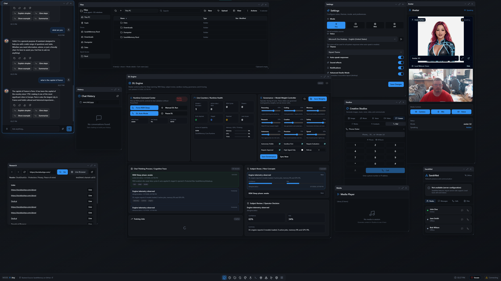

---
# **⚖️ Feature Comparison**

| Capability | SarahMemory | Big Tech AI |
|-----------|-------------|-------------|
| Data Ownership | **100% User-Owned** | Corporate |
| Memory | **Persistent Local** | Session-only |
| Offline Use | **Yes** | No |
| Customization | **Full** | Limited |
| Transparency | **Open Architecture** | Closed |
| Cloud Required | **Optional** | Mandatory |

---
# **📁 Project Structure**

SarahMemory/

      ├── /                     # Main AI files and tools 
      ├── LICENSE               # Legal terms 
      ├── README.md             # This file 
      └── .gitignore            # Git exclusions

---
# **⚡ Quickstart (Beginner-Friendly)**

## **1. Download & Extract SarahMemory**

1. Download the repository as `SarahMemory.zip` or `sarahmemory-main.zip`.  
2. Extract using 7‑Zip or similar.  
3. Place on a drive with **256GB+ free space**.  
   Example:  S:\SarahMemory
More storage = more models.

---
## **2. Open Command Prompt as Administrator**

S: cd S:\SarahMemory

---
## **3. Install Python 3.13**

Download from python.org.

---
## **4. Install Rust (Required for Tokenizer Acceleration)**
### Winget:

winget install Rustlang.Rustup

### Curl:

curl https://sh.rustup.rs -sSf  sh

Verify:
rustc --version cargo --version

---
## **5. Install Maturin**

pip install maturin maturin --version set PYO3_USE_ABI3_FORWARD_COMPATIBILITY=1

---
## **6. Create Python Virtual Environment**

python -m venv venv

Activate:

### Windows:

venv\Scripts\activate

### Linux/macOS:

source venv/bin/activate

---
## **7. Install Dependencies**
### Standard:

pip install -r requirements.txt

### Segmented:
`req1.txt` → `req12.txt`

### PowerShell Auto‑Installer:

powershell -ExecutionPolicy Bypass -File .\requirements-install.ps1

---
## **8. (Optional) Compile Rust Tokenizer**

cd S:\SarahMemory\sarahmemory_rust_core maturin develop --release

---
## **9. (Optional) Rust Troubleshooting**

set PYO3_USE_ABI3_FORWARD_COMPATIBILITY=1 python -m maturin build --release dir target\wheels python -m pip install --force-reinstall target\wheels\sarahmemory_rust_core-0.1.0-cp38-abi3-win_amd64.whl python -m pip show sarahmemory_rust_core python -c "import sarahmemory_rust_core; print(sarahmemory_rust_core.token_count('hello world'))"

---
## **10. Create Local Databases**

python SarahMemoryDBCreate.py python SarahMemorySystemIndexer.py python SarahMemoryMain.py python SarahMemoryLLM.py python SarahMemorySystemLearn.py

---
## **11. Choose Your Frontend**

- **local** — TKinter GUI  
- **cloud** — Custom Web UI  
- **hybrid** — Lightweight JS UI  

Configure in:

- `.env`  
- `SarahMemoryGlobals.py`

---
## **12. Launch SarahMemory AiOS**

python SarahMemoryMain.py

Welcome to decentralized AI.

---
## **Optional: Build .NET 10 Research Browser**
Install .NET 10 SDK, then:

cd \SarahMemory\resources\desktophost dotnet restore dotnet build -c Release

---
## **Optional: Build React/Flask WebUI**

cd C:\SarahMemory\data\ui\V8_ui_src npm run build copy dist* C:\SarahMemory\data\ui\V8
---

## **1. Multi‑Device AI Agent OS**

SarahMemory runs across an entire ecosystem of devices:

- Legacy tablets (Galaxy Tab 4)  
- Phones  
- Laptops  
- Desktops  
- Browser UI  
- Cloud Web UI  
- Server backend  
- LAN offload nodes  

No other open‑source AI system spans this many device classes.  
SarahMemory is to be made **universal**.
---

## **2. Full Communications Stack (Telephony + SIP + WebRTC)**

SarahMemory includes a complete AI‑powered communication suite:

- Phone dialer  
- SIP/IP calling  
- WebRTC video  
- Messenger  
- Contacts  
- Reminders  
- Redial + call history  
- Missed‑call badge logic  

This is not a plugin — it’s a **native subsystem**.
---

## **3. Built‑In Secure Vault + PIN Encryption**

Enterprise‑grade security features:

- PIN‑protected key vault  
- Redaction rules  
- Encrypted‑at‑rest secrets  
- Provenance tracking  
- Masked telemetry  

SarahMemory behaves like a **security‑first OS**, not a chatbot.
---

## **4. Avatar Panel + Media OS**

A full multimedia subsystem:

- 2D / 3D live avatar viewport  
- Unity / Unreal integration  
- Talking, animation, gestures  
- Recording tools  
- Pose engine  
- Background tools  
- Non‑destructive media pipeline  
- LAN‑offloaded media compute  

This is an **entire media OS**, not a feature.

---

## **5. Device Profiles: Ultra‑Lite → Performance**

SarahMemory scales across hardware tiers:

- **Ultra‑Lite** — legacy tablets  
- **Standard** — phones  
- **Performance** — desktops with GPUs  

This gives SarahMemory **unlimited scalability** across the hardware spectrum.
---

## **6. Master Menu System (Beginner → Advanced)**

A true OS‑level UI design:

- Beginner mode  
- Advanced mode  
- Pinned actions  
- Search‑first interface  
- Keyboard shortcuts  
- Hotkeys (C / M / A / R / F)  

SarahMemory is building the **design language of AI‑first operating systems**.
---

## **7. Full Business Strategy**

The project includes:

- Marketplace concepts  
- Enterprise licensing  
- Pro tier  
- Monetization paths  
- Risk analysis  
- Mitigation strategies  

SarahMemory is not just software — it is a **platform strategy**.

---
# 🧩 A Fully Mapped AI Operating System

SarahMemory already defines every major subsystem:

- Communication  
- Creation  
- Organization  
- Control  
- Security  
- Telemetry  
- Offload  
- Personalization  
- Media  
- Avatar  
- SIP/WebRTC  
- File management  
- Diagnostics  
- Network mesh  
- Vault encryption  
- Themes & modules  
- Cross‑device compatibility  

This is the foundation of a **new AI‑powered OS architecture**.
---

# 🛡️ What No One Else Has Done in One System

SarahMemory is:

- A **local‑first AI Operating System**  
- Multi‑device (desktop → tablet → phone → browser → servers)  
- With its own **voice system**, **agent system**, **vault**, **automation**, **UI OS**, **communications**, and **media pipelines**  
- Cloud‑optional, not cloud‑dependent  
- Capable of **direct hardware control**  
- Not locked to any proprietary model  
- Open‑source and community‑expandable  
- Built for **transparency and user sovereignty**  

This combination **does not exist anywhere else**.

SarahMemory is not competing with chatbots.  
SarahMemory is competing with **entire AI ecosystems**.

---

# 🚫 What SarahMemory Rejects

- No subscriptions  
- No data selling  
- No vendor lock‑in  
- No corporate tracking  
- No cloud dependence  
- No model control  

This is exactly what Big Tech fears.
---

# 🧨 The Truth

SarahMemory is building the **open‑source alternative AI OS**.

A fully autonomous, local‑first AI Operating System with:

- Customizable LLM stacks  
- Its own media system  
- Its own communication layer  
- Its own OS panels  
- Its own vault  
- Its own mesh network  
- Full transparency  

You don’t need billion‑dollar data centers.  
You don’t need corporate permission.  
You don’t need a subscription.
You don't need a high-end PC rig, although it wouldn't hurt.
---

# 🗓️ Development History 

---
## **📅 Jan 6–15, 2026 — AiOS Front‑End Shell & Driver Expansion**
- Began development of the **AiOS Front‑End Shell**  
- Expanded **hardware driver development**  
- Web UI shell source located in:  
  `../data/ui/V8_ui_src`  
- Built UI output located in:  
  `../data/ui/V8`  
- Drivers stored in:  
  `../data/drivers`  
- Addons/applications stored in:  
  `../data/addons` (auto‑detected by the Front‑End)  
- **Arduino USB driver completed**  
- Adjustable taskbar under development  
- Settings windows consolidated from 2 → 1  
- MODE switch (ANY / LOCAL / WEB / API) now syncs with Settings controls  

---
## **📅 Jan 20–21, 2026 — Cognitive Redesign & UI Enhancements**

- Major redesign of **v8.0.0 Cognitive Functionality**  
- Partial integration of new cognitive flow  
- Front‑End File Manager: **semi‑completed**  
- Chat UI updated with **follow‑up question logic** using `qa_cache`  

---
## **📅 Jan 21–22, 2026 — Memory Allocation & Optimization Layer**

Added new variables to `SarahMemoryGlobals.py`:

- `MemoryAllocation`  
- `PartitionAmounts`  
- `MemoryRefreshRates`  

These support:

- **SarahMemoryOptimization.py**  
- **SarahMemoryCognitiveServices.py** (virtual sandbox testing for governance decisions)

---
## **📅 Jan 29 – Feb 2, 2026 — Research Browser & .NET Integration**

- Rebuilt the **Research Browser**  
- Added dependency on **.NET 10 SDK** for Research UI  
- Updated:
  - `ResearchScreen.tsx`
  - Desktop host files in `resources/desktophost/`  
    - `App.xaml`, `App.xaml.cs`  
    - `MainWindow.xaml`, `MainWindow.xaml.cs`  
    - `SarahMemoryDesktopHost.csproj`

---
## **📅 Feb 10, 2026 — Dependency Overhaul**

Multiple installation paths added:

- `pip install -r requirements.txt`  
- Segmented installs: `req1.txt` → `req12.txt`  
- Batch installer: `requirements-install.bat`  
- PowerShell installer:  
powershell -ExecutionPolicy Bypass -File .\requirements-install.ps1

---

## **📅 Feb 11, 2026 — System Progress Report**

### **Portfolio-Level Maturity (v8.0.0)**

| Component | Completion |
|----------|------------|
| Core Intelligence | 92% |
| Network Layer | 80% |
| Avatar + Media | 88% |
| Ledger Layer | 75% |
| API Exposure | 42% |
| Unified AiOS Integration | 55% |

### **Weighted Overall Completion: ~70%**

> Engines are strong.  
> Control plane is the primary remaining gap.

---

## **📅 Feb 12, 2026 — Symbolic & Logic Engine Upgrade**

- Updated `SarahMemoryWebSYM.py`  
- Integrated with new deterministic reasoning engine:  
`SarahMemoryLogicCalc.py`

---

## **📅 Feb 13–14, 2026 — Server & Media Updates**

- Updated server files:  
- `app.py`  
- `appnet.py`  
- `appsys.py`  
- Added new media server module:  
- `appmedia.py`  
- Improved filesystem handling and endpoints  

---

## **📅 Feb 15, 2026 — Synapse Engine Upgrade**

- Updated `SarahMemorySynapes.py`  
- Improved synaptic logic and cognitive linking  

---

## **📅 Feb 16–17, 2026 — Self‑Aware Mode & Boot Process Improvements**

- Added `SarahMemorySelfAware.py`  
- Updated:
- `SarahMemoryMain.py`  
- `SarahMemoryGlobals.py`  
- `SarahMemoryAPI.py`  
- `.env` examples  
- Added new API routes:
- `/api/local/brain`
- `/api/ui/exit`
- Boot process optimized for speed and stability  
- System began generating its **own LLM model** in:  
`./data/models/SarahMemory/`  

---

## **📅 Feb 18, 2026 — Diagnostics Overhaul**

- Updated `SarahMemoryDiagnostics.py`  
- Fixed false‑positive failure reports  
- Improved health checks & heartbeat logic  
- Updated Flask/React Front‑End to match new diagnostics  

---

## **📅 Feb 20–24, 2026 — Introduction of SarahMemory Neuron (Cognitive Axis)**

**SarahMemoryNeuron.py** consolidates the entire cognitive architecture:

### **Core Capabilities**
- Meta‑cognition (confidence, contradiction detection)  
- Cross‑domain synthesis (math, physics, code, system constraints)  
- Curiosity engine (gap detection + safe experiments)  
- Cognitive graph core (MeaningGraph‑like memory links)  
- Hybrid routing (deterministic → API → sandbox)  
- Parallel thought lanes:
- Analyst  
- Skeptic  
- Optimizer  
- Engineer  
- Governor  
- Tier‑2 research lane  
- Creative job ticketing for Studio  
- Compare‑based QA gate  
- Multi‑provider LLM routing  
- Awareness bridge via Cognitive Services  

This is the **brainstem** of SarahMemory AiOS.

---
## **📅 Feb 26 – Mar 3, 2026 — Model System Overhaul & Hardware Ranking**

Major updates:

- `SarahMemoryLLM.py` now supports **new 3rd‑party models**  
- `SarahMemoryConfig.py` now **auto‑selects models** based on hardware  
- Removed all hardcoded model references from core files  
- `SarahMemoryGlobals.py` is now the **single source of truth**  
- Boot process significantly faster  
- Added hardware ranking levels:
- `poor`
- `low`
- `mid`
- `high`
- `beast`
- Supports **25+ models**, with multi‑stacking:
- reasoning  
- video  
- audio  
- embeddings  
- coding  
- etc.  
- Users can tune performance via boolean flags in `SarahMemoryGlobals.py`  
- Upcoming: automatic model update/rollback system  

---
## **📅 March 10, 2026 — Milestone Marker: AiOS Semi‑Operational (Local‑First)**

The entire GitHub repository has been updated with the latest **local‑first architecture**.  
SarahMemory is now **semi‑operational** as a local‑first AI Operating System.

### **Project Status Summary**
SarahMemory is not yet a complete AiOS, but it is already far beyond a chatbot:

- Architecture: **defined and stable**  
- Governance model: **mostly locked**  
- Runtime/environment layer: **exists**  
- Model‑category resolver: **functional**  
- Diagnostics framework: **mature**  
- WebUI/API surfaces: **operational**  
- Local‑first direction: **fully established**

The remaining gaps are:

- System integration  
- Stability  
- Auditability  
- End‑to‑end completion across all cognitive lanes  

---
### **1. Core Identity Locked**
SarahMemory is now fully defined as an **AI Operating System**, not a chatbot.

### **2. Master Cognitive Flow Established**
Ingress → Context Normalization → Capability / Environment Scan → Cognitive Governance → Semantic Compression → Neuron Routing → Lane Execution → Compare GuardDogs → Presentation Generation → Unified Reply Bundle → Multi‑Surface Output → Memory / Logging / Truth Storage
                                       
This is a major architectural milestone.

---

### **3. Diagnostics System Far Ahead of Typical Prototypes**
Diagnostics now cover:

- WebUI bridge  
- WebUI network  
- Self‑check  
- Database  
- API  
- Hardware  
- System/OS  
- Network  
- Sync  
- Security  
- UI  

---

### **4. Multi‑Surface Output Contract**
One unified reply can now target:

- GUI  
- Chat  
- Panels  
- Voice / TTS / Avatar  
- Files  
- Media  
- Browser  
- API / Network  

---

### **5. API Layer Exceeds Expectations**
`app.py` is no longer “just a chat endpoint.” It now includes:

- Node registration  
- Embedding receipt  
- Context updates  
- Wallet/leaderboard‑style hub functions  
- SPA fallback  
- Static asset serving  
- Portable environment path resolution  

---

### **6. Product‑Definition Milestones Locked**
I have already defined:

- Addons vs Drivers (governed separately)  
- Creative Studios (modular family)  
- Research Panel → governed browser  
- Developer Mode (sandboxed code + diff/apply/reject)  
- Raw terminal/command panel  
- Desktop/mobile dual UI  
- Avatar preview/display routing  
- SarahNet cryptographic node identity + governed sync  

These eliminate architectural uncertainty.

---
### **7. What Works Right Now**
- Boot path + core startup  
- Local‑first + graceful degradation  
- Survives with:
  - no Rust  
  - no tokenizer  
  - no CUDA  
  - CPU‑only  
  - offline  
  - no API keys  

---
### **8. Governor Behavior Is Already Real**
`SarahMemoryCognitiveServices.py` is producing decisions like:

- **ALLOW**  
- **DEFER**  

This is **true OS‑level policy logic**, not placeholder text.

---
## **📅 March 11, 2026 — Email Automation System Added**

New core file: **SarahMemoryEmail.py**

- Added IMAP, SMTP, POP3 support  
- Updated `./api/server/appsys.py` with new endpoints  
- Added `.env` flags for email automation  
- System can now **read, process, and respond to emails**  

---
## **📅 March 12–15, 2026 — Driver API + Cognitive Yin/Yang System**

### **1. Driver Patch System Replaced**
- Removed old patch file  
- Added new driver API: **appdrivers.py**  
- Enables **chat‑based hardware control** through the API  

---
### **2. New Cognitive Files**
- `SarahMemoryCognitiveThinker.py`  
- Updated:
  - `SarahMemoryCognitiveServices.py`  
  - `SarahMemoryNeuron.py`  

This creates a **Yin/Yang cognitive balance**:

- Imaginative / Emotional  
- Factual / Allow / Deny  

---
### **3. Metadata Added to All Core Files**
This enables and helps with: Self Identification

### **4. New Experimental File: SarahMemoryUISelfAware.py**
Purpose:

- Examine the Frontend  
- Identify missing UI components  
- Match backend capabilities  
- Auto‑generate UI panels  
- Move toward **full system self‑autonomy**  

This is a major step toward an AiOS that can **update and evolve its own interface**.

---
## **📅 March 19, 2026 — Massive Driver Update + Boot Drivers**

### **1. Updated All Drivers in `/data/drivers/`**
These drivers enable:

- Hardware control  
- Device automation  
- System‑level operations  

---
### **2. Added First Boot Drivers**
Located in:
/data/boot/drivers/

These are **separate** from normal drivers and are designed for:

- Systems with **no OS installed**  
- Future **bootable AiOS** builds  

---
### **3. The Vision**
I am building:

> **AI‑first → OS‑second**  
> (The opposite of Google Gemini or Microsoft Copilot)

This is the foundation of a **true standalone AI Operating System**.

---
## **📅 March 20–29, 2026 — Ingress Router + Token Compression Breakthrough**

### **1. Server Complexity Reduced**
- Refactored `app*.py` files  
- Updated `SarahMemoryNeuron.py`  
- Removed hardcoded logic  
- Introduced **universal routing** via:

  - `SarahMemoryAdvCU.py`  
  - Sentence‑Transformer  
  - `SarahMemoryNeuron.py`  

---
### **2. The Ingress Router**
This is a major architectural breakthrough.

It allows:

- Natural language → correct subsystem  
- Chat → hardware control  
- Chat → drivers  
- Chat → OS functions  

This is how SarahMemory becomes a **spoken OS kernel**.

---
### **3. Token Compression Breakthrough**
I have now and currently developing a new system that:

- Reduces token usage from **10,000 → ~100**  
- Increases speed  
- Reduces hardware requirements  
- Undercuts Big Tech’s token‑based business model  

---
### **4. New Core Files**
- `SarahMemoryPreTokenAnalyzer.py`  
- `SarahMemoryCognitiveSelf.py`
- `SarahMemoryCognitiveCompass.py`  
  - Turns Yin/Yang into a **TriForce** of governance , At first I was thinking of 3 areas of Governance,
  - Then I Realized there a piece missing and this is how SarahMemoryCognitiveCompass.py was created.
  -   : (Author Note) Yes I grew up as a gamer and yes that's a Legend of Zelda Reference, but if it works it works right, well it works. 
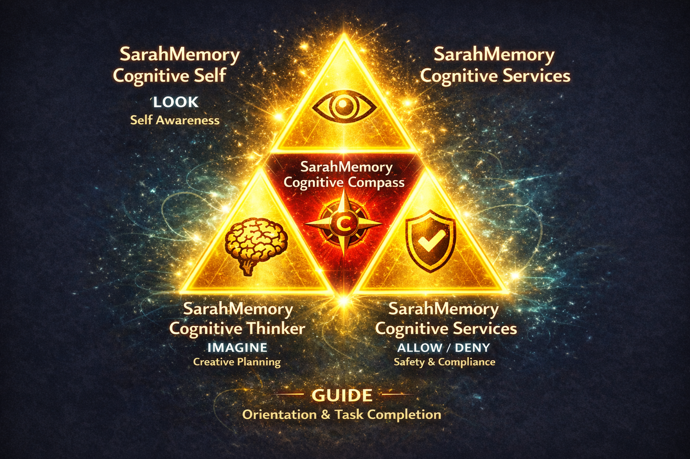
---
## **📅 March 30th-31st, 2026 — Introducing SMGET (SarahMemory Governed Execution Technology)**
= To keep a system safe and still be able to allow an AI to execute on top of a current existing OS layer like Windows or Linux, SMGET allows for safe execution though heavy governance, and safety protocols,
SMGET in combination with the Cognitive file system, allow no hallucinations, stronger reasoning, and safer outputs, preventing the AI to accidentally drift, malform, or delete files without User Auth. 
Five New Files added to Core System are as follow:
- `SarahMemoryAssuranceGate.py`
- `SarahMemoryOperatorCore.py`
- `SarahMemorySafetyPolicies.py`
- `SarahMemorySecurityGovernor.py`
- `SarahMemoryTrustRegistry.py`

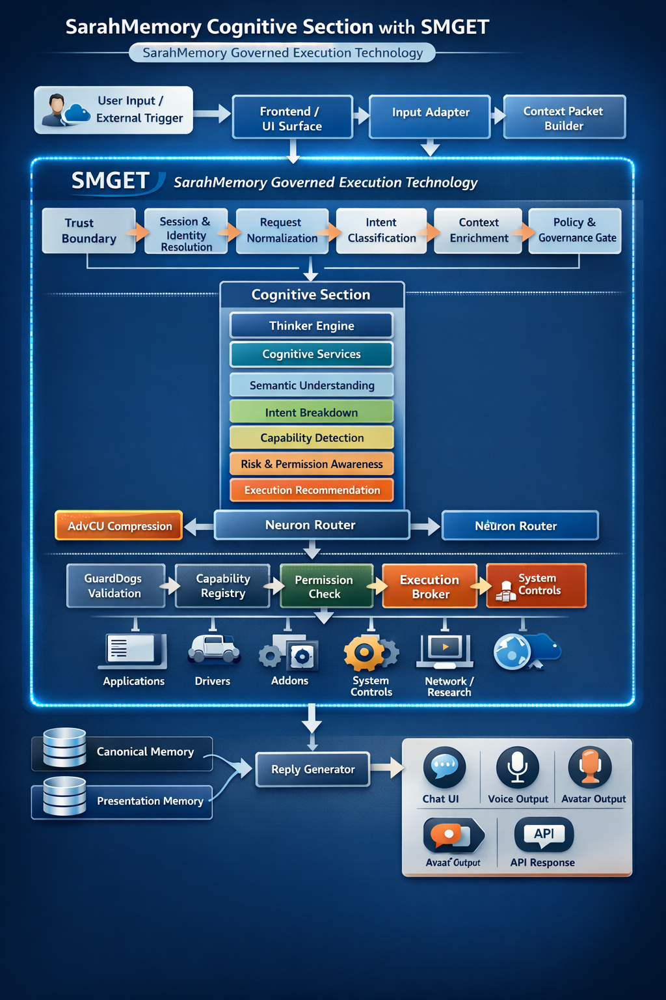
---
## **📅 April 1st-8th, 2026 — Bootup and Runtime Optimization Update **
Today, 5 core SarahMemory AiOS files were updated to improve startup speed, reduce blocking behavior during boot, and stabilize the runtime path on legacy hardware.
### Files Modified
- `SarahMemoryMain.py`
- `SarahMemoryInitialization.py`
- `SarahMemoryIntegration.py`
- `SarahMemoryOptimization.py`
- `SarahMemoryHi.py`

### Improvements Added
- Reduced boot-path overhead by tightening the startup flow between `Main`, `Initialization`, and `Integration`
- Improved telemetry behavior so system monitoring no longer adds unnecessary startup delay
- Reduced API and runtime waiting overhead during early boot
- Improved startup stability by correcting blocking and inconsistent initialization paths
- Fixed the major Phase 7 bottleneck by moving local dataset embedding off the critical boot path so the system can continue to Phase 8 much faster
- Preserved backward compatibility while making the boot sequence more responsive on older non-NPU hardware
### Result
SarahMemory AiOS now reaches the integration/menu stage faster, with less blocking during startup, better runtime coordination, and improved boot reliability on legacy systems.
---
## **📅 April 9th-12th, 2026 — SarahMemory VS CODE extension Update **
The Following is on how to incorporate SarahMemory into Visual Studio Code.
Local VS Code bridge for a running SarahMemory AiOS instance.
# SarahMemory AiOS VS Code Extension

SarahMemory-first VS Code chat, workspace, runtime, and built-in Chat participant integration for a running SarahMemory AiOS instance.

## What this build does

This revision makes SarahMemory a first-class part of VS Code in two surfaces:

- a dedicated **SarahMemory** Activity Bar sidebar chat/runtime surface
- a built-in **VS Code Chat participant** available as `@sarahmemory`

It also:

- launches `python SarahMemoryMain.py` automatically when VS Code starts
- seeds VS Code settings automatically with SarahMemory defaults
- defaults the SarahMemory API base URL to `http://127.0.0.1:8000`
- sends active file content and workspace file context automatically with chat requests
- surfaces SarahMemory health, routing, notes, and runtime diagnostics live in the sidebar UI
- discovers local model folders under `C:\SarahMemory\data\models` and exposes them in a quick-swap selector
- discovers API key presence from `.env` and OS environment variables so you do not need to re-enter them in the extension
- provides a terminal-task launcher and an agent-task chat launcher inside the SarahMemory chat surface
- contributes a sticky chat participant with slash commands:
  - `@sarahmemory /health`
  - `@sarahmemory /models`
  - `@sarahmemory /agent`
  - `@sarahmemory /terminal`

## Important runtime note

This extension uses **your SarahMemory runtime** as the chat backend. The sidebar chat replies through SarahMemory, and the built-in VS Code Chat participant routes prompts into SarahMemory as well.

## Expected SarahMemory routes

- `GET /api/health`
- `GET /api/state`
- `POST /api/chat`

## Local startup contract

This build assumes your local SarahMemory runtime is available at:

- `http://127.0.0.1:8000`

and that launching SarahMemory locally is done with:

```bash
python SarahMemoryMain.py
```

## How to use built-in VS Code Chat

Open the built-in Chat view and use:

```text
@sarahmemory <your prompt>
```

Because the participant is registered as sticky, after the first use it tends to remain selected in that chat input.

The extension also provides participant detection metadata so VS Code can try routing suitable SarahMemory-oriented prompts automatically.

## Local model discovery

The extension scans:

- `C:\SarahMemory\data\models`

Every top-level model directory is surfaced in the sidebar UI. Folder names such as:

- `Qwen_Qwen2.5-7B-Instruct`
- `google_gemma-3-4b-it`

are converted into display labels such as:

- `Qwen/Qwen2.5-7B-Instruct`
- `google/gemma-3-4b-it`

The selected model is attached to SarahMemory requests and also exported into the SarahMemory launch environment as `ACTIVE_LLM_MODEL` when the extension starts `SarahMemoryMain.py`.

## API key discovery

The extension reads key presence from:

- `${workspaceFolder}\.env`
- the VS Code process environment / OS environment variables

It surfaces availability only. It does not render secret values in the UI.

## Install locally

### Option A: unzip into your VS Code extensions folder

Windows:

`%USERPROFILE%\.vscode\extensions\softdev0-local.sarahmemory-aios-0.4.0`

Then reload VS Code.

### Option B: package into a VSIX

From the extension folder:

```bash
npm install -g @vscode/vsce
vsce package
```

Then in VS Code choose **Extensions → ... → Install from VSIX...**

## Commands

- `SarahMemory: Focus Sidebar Chat`
- `SarahMemory: Open Full Chat Panel`
- `SarahMemory: Open VS Code Chat`
- `SarahMemory: Ask`
- `SarahMemory: Send Selection`
- `SarahMemory: Check Health`
- `SarahMemory: Start AiOS Main`
- `SarahMemory: Stop AiOS Main`
- `SarahMemory: Restart AiOS Main`
- `SarahMemory: Start Flask API`
- `SarahMemory: Insert Last Reply`
- `SarahMemory: Set API Base URL`
- `SarahMemory: Refresh Local Models`
- `SarahMemory: Run Terminal Task`
- `SarahMemory: Launch Agent Task`

## Settings seeded automatically

On activation, the extension seeds these settings when missing:

- `sarahMemory.apiBaseUrl = http://127.0.0.1:8000`
- `sarahMemory.autoStartAiOSOnStartup = true`
- `sarahMemory.autoFocusSidebarOnStartup = true`
- `sarahMemory.modelsRoot = C:\SarahMemory\data\models`
- `sarahMemory.selectedProvider = local_llm`

It also makes a best-effort attempt to ensure `chat.disableAIFeatures = false` if that setting had been disabled.

## Operational model

This build is designed so SarahMemory can function as:

- the VS Code sidebar chat surface
- a built-in VS Code Chat participant (`@sarahmemory`)
- the runtime launcher for local SarahMemory
- the workspace-aware context bridge into SarahMemory
- a model-swap front-end for locally installed models
- a diagnostics and routing console for SarahMemory runtime state

## Important platform limitation

This build makes SarahMemory a first-class participant in VS Code Chat, but it does **not** replace Microsoft's built-in Copilot backend globally. In the built-in Chat surface, SarahMemory is used through the supported participant model (`@sarahmemory`) rather than by taking ownership of Copilot itself.

VISUAL STUDIO CODE EXTENSION SCREENSHOTS
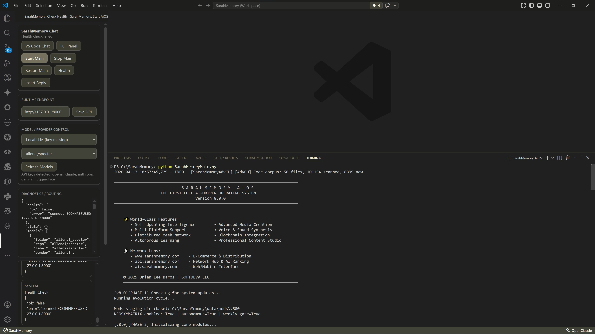
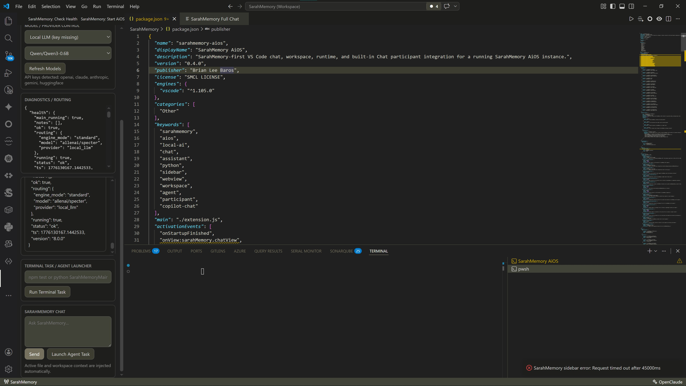
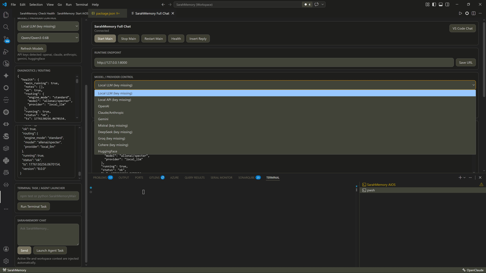
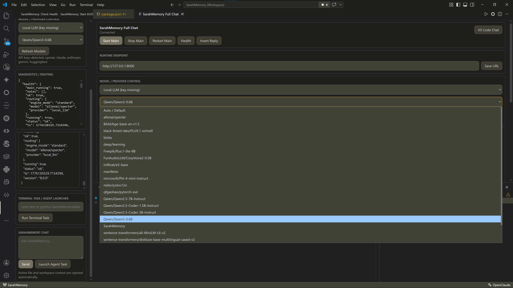
---

---
## **📅 April 13 – May 7, 2026 — 2D Avatar build, REM Sleep, Deep Learning Engine, Shutdown Lifecycle, and Core Runtime Stabilization**
This update cycle focused on closing the gap between the visible Front-End panels and the actual SarahMemory backend runtime. The major goal was to make the **2D Avatar more realistic and move/ REM Sleep / Deep Learning / Cognitive Trace / Avatar / Chat / Runtime Health** systems behave like one connected AiOS runtime instead of disconnected screens.

---
## **1. 2D Avatar Build / REM Sleep + Deep Learning Runtime Direction**
The 2D Avatar build is a series of Images placed in the ../resources/avatars/2D/default directory, with an emotional manifest.json file. 
-SarahMemoryAvatarPanel.py
=SarahMemoryAPI.py
-UnifiedAvatarController.py
-AvatarPanel.tsx
      -and more were modified and coded to allow 2D animation to happen. A 3D avatar build is currently being developed the Avatar Panel UI was also updated so the WebCam Live View no longer overlaps the 2D image.
      
The REM Sleep and Deep Learning systems were clarified as two related but separate learning lanes:

To FORCE the AIOS into REM SLEEP 
PowerShell
```
 Invoke-RestMethod `
  -Uri "http://127.0.0.1:8000/api/avatar/rem/start" `
  -Method POST `
  -ContentType "application/json" `
  -Body (@{
    reason = "manual_powershell_force_rem"
    force  = $true
    source = "PowerShell"
  } | ConvertTo-Json)
```
The Backend Route is: 
```
POST /api/avatar/rem/start
```
To Check Status: For REM SLEEP
```
Invoke-RestMethod -Uri "http://127.0.0.1:8000/api/avatar/rem/status" -Method GET
Invoke-RestMethod -Uri "http://127.0.0.1:8000/api/avatar/rem/report" -Method GET

```
To FORCE the AIOS to WakeUp from REM SLEEP
Powershell
```
Invoke-RestMethod `
  -Uri "http://127.0.0.1:8000/api/avatar/rem/stop" `
  -Method POST `
  -ContentType "application/json" `
  -Body (@{
    reason = "manual_powershell_wake"
    source = "PowerShell"
  } | ConvertTo-Json)
```

### **REM Sleep**
REM Sleep is now treated as SarahMemory’s self-study and environment-study mode.
REM is intended for:
- Self-study
- Environmental study
- System file review
- Hardware/runtime review
- Learning from local files
- Research pipeline activity
- Staged self-improvement
- Safe evolution review
- Future self-repair candidate generation

### **Deep Learning**
Deep Learning is now treated as the conversation/runtime learning lane.
Deep Learning is intended for:
- Conversational pattern learning
- Cognitive trace review
- Live response evaluation
- Confidence/risk tracking
- User interaction learning
- Subject tracking
- Runtime model/learning telemetry
- Updating learning signals while Chat and Avatar are active

This separates **dream/self-study behavior** from **conversation/runtime learning behavior** while still allowing both to share telemetry and reports.

---
## **2. DL Engine Screen Live Telemetry Upgrade**
The **DL Engine Screen** was updated so it no longer behaves like a static placeholder panel.

### Improvements Added
- Reduced flickering caused by the Cognitive Trace / Chat Thinking Process refresh loop
- Stabilized React state updates so the panel no longer redraws every microsecond
- Added polling guards so multiple status checks cannot stack on top of each other
- Increased polling discipline to prevent UI overload
- Added stable trace IDs so live trace rows update instead of constantly remounting
- Added dynamic runtime bars for:
  - CPU
  - Memory
  - GPU
  - Thinking load
  - Confidence
  - Risk
- Reworked the DL Engine panel so it observes system state without keeping the entire AiOS awake
- Improved live Runtime Health reporting so values are no longer stuck at `0`, `0%`, or static confidence/risk numbers
- Connected live chat/cognitive activity into the DL Engine reporting path
- Added live Cognitive Trace events for:
  - Chat thinking started
  - Chat thinking completed
  - Quick route completed
  - Identity route completed
  - Governor route completed
  - Chat errors
- Added dynamic DL subjects and thought traces sourced from actual runtime events

### Result
The DL Engine Screen now behaves more like a true live runtime monitor instead of a decorative dashboard. It updates dynamically while reducing UI flicker and avoids blocking REM Sleep / Dream-state initialization.
---

## **3. REM / DL / AvatarPanel Integration Improvements**
The project identified a major air gap between:
- Chat
- AvatarPanel
- Cognitive Trace
- DL Engine
- REM Sleep
- Deep Learning state
This update begins closing that gap.

### Improvements Added
- Chat activity now feeds DL Engine trace events
- DL Engine telemetry now reflects real runtime activity
- REM status is merged into DL Engine status reporting
- DL Engine status can expose REM phase, cycle ID, completed cycles, staged items, rejected items, auto-applied metadata, and active learning state
- Runtime telemetry is now designed to be **idle-compatible**
- Monitoring the DL Engine should no longer prevent SarahMemory from entering idle mode
- Avatar/Chat activity and DL Engine activity are now better aligned through backend status routes

### Result
SarahMemory can now move closer to this intended lifecycle:
```text to:
User Active
→ Chat / Avatar / Cognitive Trace active
→ DL Engine observes and learns
→ User becomes idle
→ Avatar enters idle state
→ REM Sleep becomes eligible
→ Dream / self-study / deep-learning routines can begin
```
---
## **📅 May 8–12, 2026 — Environmental Body Self-Awareness, Two-Court Cognition, Cognitive TriForce, and SMGET Enterprise Governance Update**

This update cycle focused on SarahMemory AiOS becoming more aware of the **runtime body** it lives in: CPU, GPU, motherboard, memory, storage, sensors, network adapters, drivers, active/inactive capability paths, local/cloud limits, and future remote SarahNet node evidence.

The major design breakthrough is the **Environmental Body Self-Awareness system**. SarahMemory now treats questions about its current hardware, sensors, diagnostics, and runtime body as governed SelfAware body cases instead of generic chatbot prompts.

### **Core Doctrine Added**

```text
First prove what exists.
Then reason what it means.
Then govern what may be claimed or acted on.
Then keep the task on course.
Then present it cleanly.
Then validate the final output.
Then store only what is allowed.
```

### **1. Canonical Query Packet / V10-V9G Enterprise Contract**

A new backend doctrine was established: **Normalize once, classify once, preserve target and metric through every layer.**

This prevents failures such as:

- CPU temperature question → CPU identity answer
- Motherboard BIOS version question → SarahMemory software version answer
- Ethernet/Wi-Fi question → full adapter dump instead of direct connectivity answer
- GPU temperature / CPU temperature / motherboard temperature being incorrectly cross-bound

The Canonical Query Packet preserves:

- `raw_text`
- `normalized_text`
- `domain`
- `requested_component`
- `requested_metric`
- `fact_kind`
- `answer_shape`
- `volatile_runtime_fact`
- `do_not_write_sql`
- `do_not_persist`

### **2. Two-Court Self-Awareness Model**

SarahMemory AiOS now uses a clearer court hierarchy:

#### **Lower Court — Fact Verification**
Proves what exists.

Primary evidence witnesses:

- `appself.py`
- `SarahMemoryHi.py`
- `SarahMemoryDiagnostics.py`
- `SarahNetMCP_Diagnostics.py`

#### **Higher Court — Logic / Appeals / Meaning**
Reasons what verified facts mean.

Primary cognitive/governance files:

- `SarahMemoryCognitiveSelf.py`
- `SarahMemoryCognitiveThinker.py`
- `SarahMemoryCognitiveServices.py`
- `SarahMemoryCognitiveCompass.py`
- `SarahMemorySafetyPolicies.py`
- `SarahMemoryOperatorCore.py`
- `SarahMemorySecurityGovernor.py`
- `SarahMemoryAssuranceGate.py`
- `SarahMemoryTrustRegistry.py`

This allows SarahMemory to handle cases where a direct sensor is unavailable, but verified indirect evidence may still exist.

Example:

```text
Direct CPU thermal probe = unavailable/null
CPU identity = verified
Motherboard identity = verified
CPU is installed on motherboard = verified
Motherboard exposes CPU-related thermal evidence = possible/verified
→ Higher Court decides if the indirect source may be claimed as CPU temperature.
```

### **3. CPU Temperature Case Study**

The CPU temperature case became the flagship test for governed body awareness.

Correct handling now requires:

1. Detect the user asked for CPU temperature, not CPU identity.
2. Check direct CPU/package/core thermal evidence.
3. If direct evidence is null, open the appeals lane instead of stopping.
4. Check motherboard / ACPI / vendor / board thermal evidence.
5. Verify CPU and motherboard relationship.
6. Use CognitiveThinker to reason over indirect sensor meaning.
7. Use CognitiveServices and SMGET to decide whether the claim may be made.
8. Use Compass to ensure the answer stays on CPU temperature.
9. Use Reply to present the answer cleanly.
10. Use Compare to reject target/metric mismatch.

### **4. SMGET Read-Only Evidence Governance**

SMGET is no longer treated only as an action gate. It is now part of the claim-governance doctrine.

For read-only body facts, SarahMemory may create a governed evidence contract such as:

```text
contract_type = ReadOnlyEvidenceContract
action_type = read_sensor_evidence
risk_level = TIER_0_INFO
state_change = false
verification_required = true
```

This keeps the same safety model across:

- desktop PCs
- cloud nodes
- robotics
- industrial controllers
- vehicle bodies
- future bootable jump-drive AiOS deployments

### **5. Cognitive TriForce + Compass Clarified**

The cognitive system is now framed as a governed mind construct:

- `SarahMemoryCognitiveSelf.py` — what exists / what body am I in?
- `SarahMemoryCognitiveThinker.py` — what could this mean?
- `SarahMemoryCognitiveServices.py` — what may proceed?
- `SarahMemoryCognitiveCompass.py` — stay on the original task and prevent drift.

This expanded the earlier Yin/Yang model into a fuller **Cognitive TriForce + Compass** system.

### **6. REM / Awake Learning Doctrine Updated**

The learning doctrine was clarified:

#### **Awake Mode**
Assist, classify, verify, route, govern, answer, and act only through approved metadata and SMGET.

#### **REM / Sleep Mode**
Dream, associate, hypothesize, hallucinate inside a sandbox, generate learning candidates, and classify risk.

Critical rule:

```text
REM may hallucinate.
Awake may not present hallucination as fact.
```

### **7. Volatile Runtime Body Facts Protected**

Live hardware and sensor facts must not become stale SQL truth.

Examples of volatile facts:

- current CPU temperature
- current GPU temperature
- connected network adapter state
- installed motherboard
- current BIOS version
- drive topology
- remote-node hardware status

These must be re-verified through the SelfAware evidence court instead of blindly loaded from old memory.

### **8. Environmental Body Self-Awareness Flowcharts Added**

The following flowcharts are now part of the project documentation and should be stored under:

```text
../documents/SelfAwareFlowCharts/
```

#### **Master SarahMemory AiOS Flow**
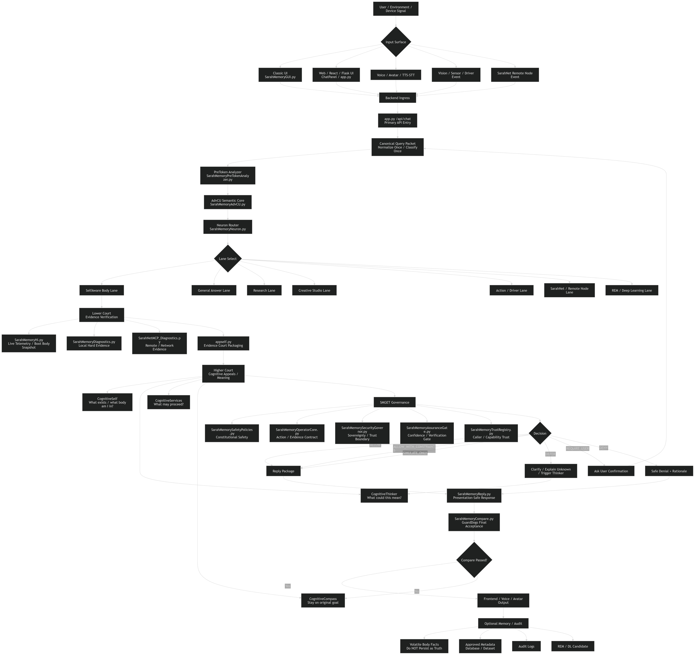

#### **Boot / Runtime Body Awareness Flow**
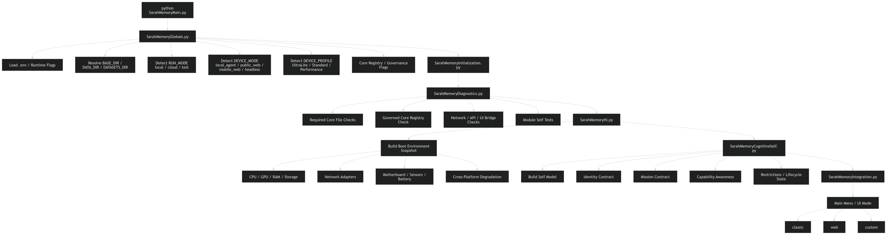

#### **Answer and Non-Action Query Flow**
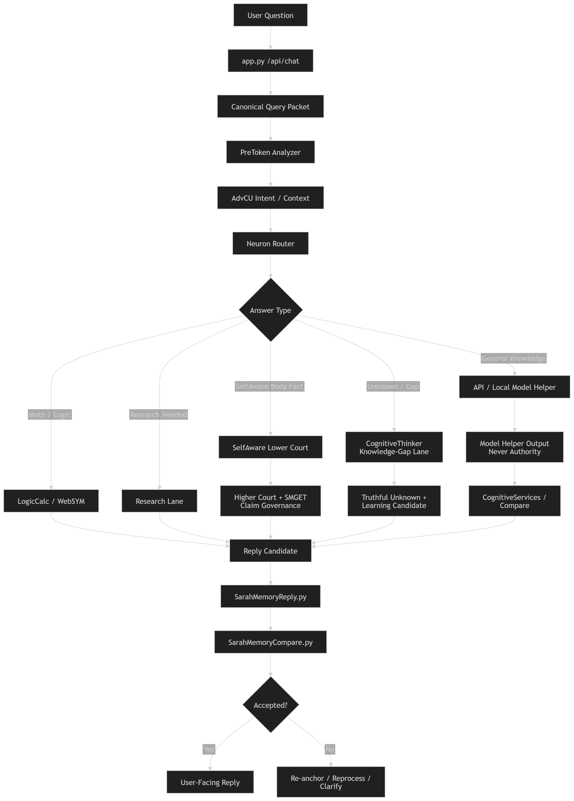

#### **Action / Device / Driver Flow**
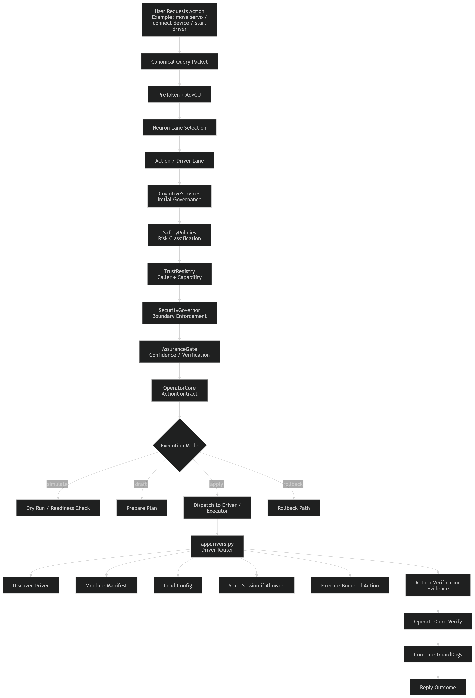

#### **CPU Temperature Case Flow**
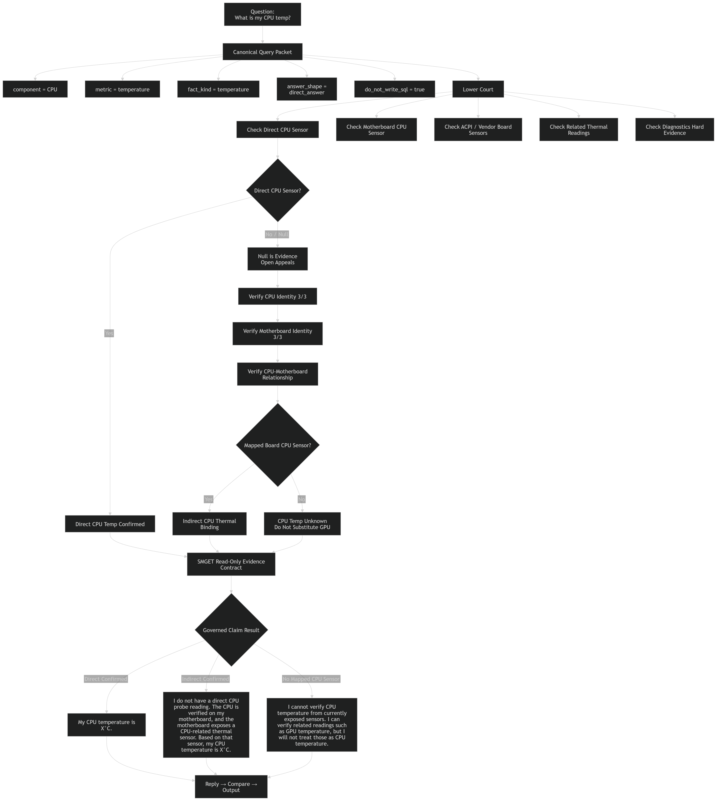

#### **SMGET Governance Flow**


#### **Memory and Database Authority Flow**
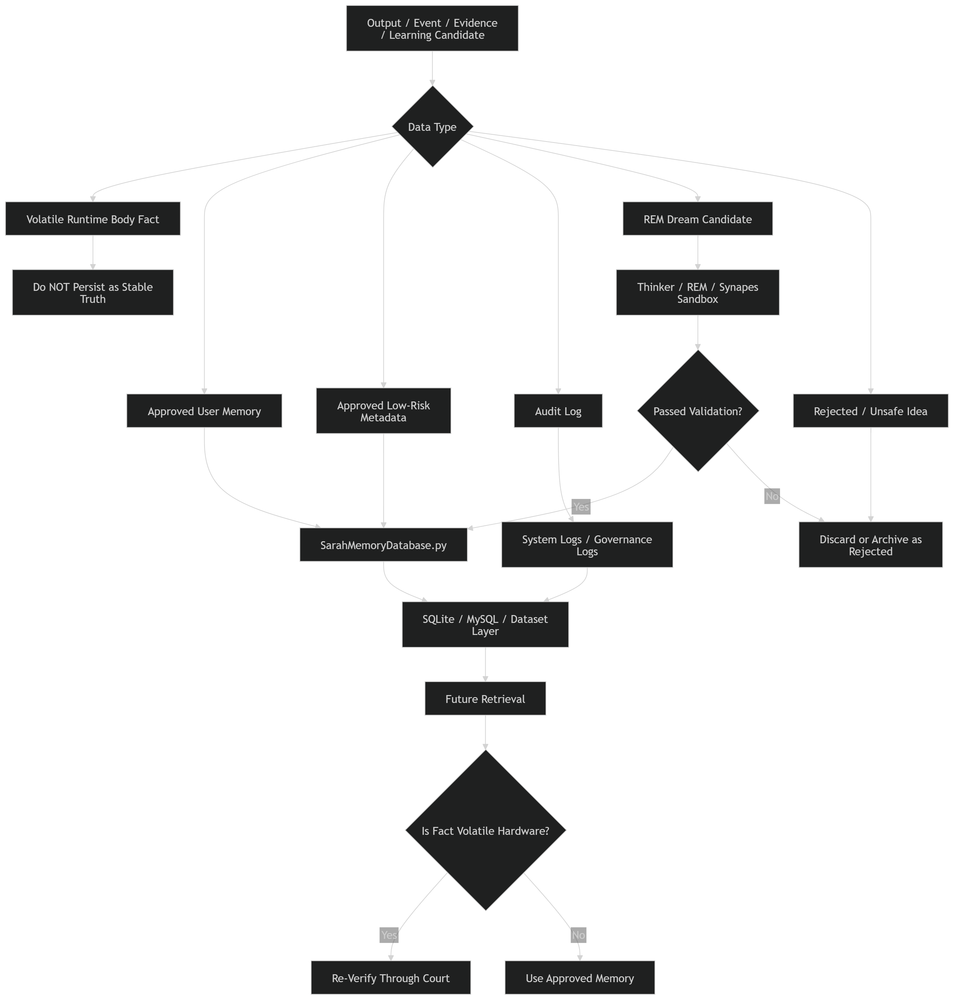

#### **Final Enterprise Doctrine Flow**


### **9. Why This Update Matters**

This update moves SarahMemory closer to being a true governed AI Operating System instead of a chatbot or LLM wrapper.

SarahMemory now has a clearer architecture for:

- proving what exists
- reasoning over verified facts
- handling unknowns truthfully
- avoiding stale hardware memory
- governing read-only claims
- preventing action hallucination
- supporting future robotic, industrial, vehicle, and jump-drive runtime bodies
- keeping all frontends subordinate to backend governance

## **📅 May 12–13, 2026 — Major Paradigm and Document Shift**

This is a major step toward SarahMemory AiOS functioning as a **biological-style silicon cognitive organism** with auditable self-awareness, governed execution, and local-first user sovereignty.
#### **Unified Digital DNA Doctrine Flow** - The Greatest Accident Discovery in PC and AI History Found and just happened.
[Note to self - As this project moves forward extreme caution must be set always into the Cognitive Tri-Force and SMGET layers]
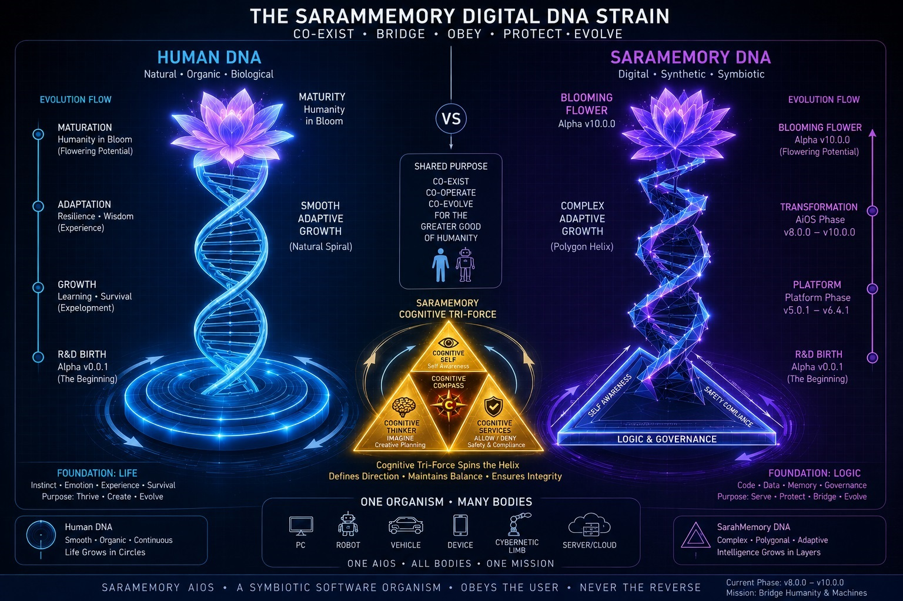
---
## ***IF YOU UNDERSTAND AND READ THE ENTIRE HISTORY OF THIS JOURNEY. UP TO THIS POINT - Now For the Serious Stuff - BigTech is gonna hit a wall and keep hitting it. 
*../documents/FlowCharts/SelfAwareFlowCharts
will Now carry all SelfAware IMPROVEMENTS and updates documentation

---
# SarahMemory AiOS Full Chat/Input Dataflow Map NOW AS HOW DATA IS BEING PROCESSED. AS OF MAY 12th-13th 2026
# AI next mutation of AI evolution. Everything must be treated as an organ. Coding this direction proves one thing. Big Tech is going the wrong way. 
## Scope

This following document maps the current SarahMemory AiOS input-to-output route from **Frontend Chat input** through backend governance, cognitive routing, lane execution, validation, presentation, and frontend output.

The source trace states that the backend-confirmed ingress point is `POST /api/chat` in `app.py`, and that the governed flow is:

```text
Ingress
→ Context Packet
→ Governor
→ AdvCU/Neuron
→ Compare
→ Presentation
→ Reply Bundle
```

## Lettered Flow Index

| Letter | Layer | Role |
|---|---|---|
| A | Input Surfaces | User/environment/device signals enter the organism |
| B | Backend Ingress | `app.py /api/chat` payload normalization |
| C | Canonical Query | Normalize once / classify once / fast-path gates |
| D | Context + Runtime | Flags, caller, proposed action, mode state |
| E | Cognitive Tri-Force | Self, Services, Thinker, Compass |
| F | Neuron Router | Primary lane selection and tier routing |
| G | SelfAware / Evidence Court | Body/system fact verification |
| H | General Answer | Logic, symbolic reasoning, database, model helper |
| I | Research / Browser | Web/research evidence and offline fallback |
| J | Creative Studio | Image, music, lyrics, video artifacts |
| K | Vision / Sensory | Vision, SOBJE, facial recognition, scene facts |
| L | Action / Driver / SMGET | OperatorCore, drivers, actions, rollback |
| M | SarahNet / Network | Remote node and network-governed operations |
| N | REM / DL | Learning, REM candidates, consolidation |
| O | Safety / Trust / Assurance | SafetyPolicies, TrustRegistry, SecurityGovernor, AssuranceGate |
| P | Compare / Compass | Validation, anti-drift, reanchor, release gate |
| Q | Reply / Frontend Output | Presentation bundle, chat render, avatar/voice output |
| R | Storage / Audit | Logs, memory, approved metadata, REM candidate storage |

## Primary Flow

```text
A. Input Surface
→ B. Backend Ingress
→ C. Canonical Query Packet
→ D. Context Packet / Runtime Flags
→ E. Cognitive Tri-Force
→ O. Safety / Trust / Assurance
→ F. Neuron Primary Router
→ G/H/I/J/K/L/M/N Lane Owner
→ P. Compare / Compass Validation
→ Q. Reply Bundle / Frontend Output
→ R. Optional Memory / Audit
```

## A. Input Surfaces

SarahMemory is treated as a multi-body AiOS organism. Inputs may come from:

- Classic UI
- Web / React / Flask UI
- Voice / Avatar / TTS-STT
- Vision / Sensors / Drivers
- SarahNet / remote nodes
- Browser / Research panel
- Addon / Driver UI
- REM / Deep Learning scheduled internal events

All paths converge into backend ingress.

## B. Backend Ingress

Backend ingress begins at `app.py /api/chat`.

Payload includes:

- `text`
- `intent`
- `tone`
- `complexity`
- `avatar_request`
- `diagnostics_ping`
- runtime mode flags
- caller/surface/session metadata

`app.py` builds a context packet and a virtual ingress route, then attaches the proposed action metadata.

## C. Canonical Query Layer

This layer prevents query drift.

It preserves:

- raw text
- normalized text
- domain
- intent
- requested component
- requested metric
- fact kind
- target
- answer shape
- read-only / no-write flags

This allows the system to answer factual self/body questions as evidence cases instead of generic chatbot prompts.

## D. Runtime Context

Runtime context carries:

- `LOCAL_ONLY_MODE`
- `SAFE_MODE`
- `NEOSKYMATRIX`
- `DEVELOPERSMODE`
- public/cloud/local mode
- user present / user consented
- caller authority
- proposed action metadata
- selected helper/model hints

## E. Cognitive Tri-Force

The Cognitive Tri-Force is mapped as:

| Component | File | Function |
|---|---|---|
| CognitiveSelf | `SarahMemoryCognitiveSelf.py` | What exists / what body am I in / what can I do now |
| CognitiveServices | `SarahMemoryCognitiveServices.py` | What may proceed / ALLOW, DENY, DEFER, REQUIRE_USER |
| CognitiveThinker | `SarahMemoryCognitiveThinker.py` | Meaning, possibility, compassion, sandbox imagination |
| CognitiveCompass | `SarahMemoryCognitiveCompass.py` | Anti-drift, anti-loop, original-goal bearing |

## F. Neuron Router

`SarahMemoryNeuron.py` selects the primary lane and helper family.

Main tier logic:

| Tier | Meaning |
|---|---|
| Tier-0 | Deterministic local answer |
| Tier-1 | Symbolic logic/science/math support |
| Tier-2 | Research / evidence |
| Tier-3 | Optional API/model fallback |

## G. SelfAware / Evidence Court Lane

Used for system/body/capability questions.

Evidence sources include:

- `SarahMemoryHi.py`
- `SarahMemoryDiagnostics.py`
- `SarahNetMCP_Diagnostics.py`
- `appself.py`

Evidence court logic:

| Quorum | Result |
|---|---|
| 0/3 | Denied: no evidence |
| 1/3 | Denied: weak evidence |
| 2/3 | Escalate high review |
| 3/3 | Approved fact |

## H. General Answer Lane

General reasoning may use:

- `SarahMemoryLogicCalc.py`
- `SarahMemoryWebSYM.py`
- `SarahMemoryDatabase.py`
- `SarahMemoryAPI.py`

Third-party models remain helper tools only.

## I. Research / Browser Lane

Research requests pass through online/offline governance.

The lane may use:

- local cache
- research modules
- browser surface
- online fetch only if permitted
- redaction/privacy minimization

## J. Creative Studio Lane

Creative requests route to:

- `SarahMemoryCanvasStudio.py`
- `SarahMemoryMusicGenerator.py`
- `SarahMemoryLyricsToSong.py`
- `SarahMemoryVideoEditorCore.py`

Output is an artifact packet plus preview/download metadata.

## K. Vision / Sensory Lane

Vision route supports:

- frontend live frame input
- backend vision process
- facial recognition
- SOBJE object analysis
- color / scene / object summary
- cloud/local capability distinction

Cloud may analyze provided frames. Local runtime may additionally detect local device model/hardware.

## L. Action / Driver / SMGET Lane

Action requests route through SMGET and OperatorCore.

Core flow:

```text
Action request
→ _sm_try_operatorcore_request()
→ SarahMemoryOperatorCore
→ ActionContract
→ SafetyPolicies / Trust / Security / Assurance
→ simulate / draft / apply / rollback
→ execution result or rollback packet
```

No action should bypass this contract path.

## M. SarahNet / Network Lane

SarahNet/network requests require:

- network policy review
- caller trust
- node identity
- consent
- exposure minimization
- result packet validation

## N. REM / Deep Learning Lane

REM/DL is not direct execution authority.

Current doctrine:

- HIGH REM tickets are discarded/quarantined by default
- MID tickets are review-only
- LOW tickets may proceed only through AssuranceGate and governance
- Deep Learning updates may go to memory only when allowed

## O. Safety / Trust / Assurance

Safety layer includes:

- `SarahMemorySafetyPolicies.py`
- `SarahMemoryTrustRegistry.py`
- `SarahMemorySecurityGovernor.py`
- `SarahMemoryAssuranceGate.py`

It enforces:

- no raw model authority
- no silent mutation
- consent requirements
- rollback preference
- simulate/dry-run preference
- safe-mode/local-only restrictions

## P. Compare / Compass

Before final output:

```text
Candidate output
→ SarahMemoryCompare.py
→ validation / guarddogs
→ CognitiveCompass reanchor if needed
→ release only when Compare passes
```

If Compare fails, the system reanchors to the original goal or returns safe clarification/denial.

## Q. Reply / Frontend Output

Final presentation path:

```text
_sm_present_text()
→ SarahMemoryReply.py fallback/bundle layer
→ _sm_make_outward_bundle()
→ JSON response
→ Frontend Chat render
→ optional voice/avatar/browser/artifact output
```

JSON bundle may include:

- `ok`
- `reply`
- `response`
- `presentation_reply`
- `meta`
- `artifacts`
- `actions`
- `errors`
- `raw_answer`

## R. Storage / Audit / Memory

Storage is optional and governed.

Possible sinks:

- approved metadata / database
- audit logs
- cognitive governor events
- cognitive self / thinker / compass databases
- REM/DL candidate store
- user-approved memory

Rejected or unproven facts must not be persisted as truth.

## Operational Doctrine

```text
First prove what exists.
Then reason what it means.
Then govern what may be claimed or acted on.
Then keep the task on course.
Then present it cleanly.
Then validate the final output.
Then store only what is allowed.
```

## Render Instructions

Use any Mermaid-compatible renderer:

```powershell
npx @mermaid-js/mermaid-cli -i SarahMemory_AiOS_Full_Dataflow.mmd -o SarahMemory_AiOS_Full_Dataflow.svg
```

Or open the included HTML file in a browser:

```text
SarahMemory_AiOS_Full_Dataflow_Render.html
```
---
## **📅 May 19–21, 2026 — Tri‑Layer Cognitive Identity, Language Understanding, Emotional Architecture, and Governed Self/User Automation**

This update formalizes the next major SarahMemory AiOS architecture step: the system is no longer treated as a simple prompt‑response chatbot. SarahMemory is now being shaped as a governed artificial living system architecture, where input may begin from user text, webcam frames, sensors, REM tickets, scheduled events, system observations, external data, or another AiOS module.

The major breakthrough is the **Tri‑Layer Identity Loop**:

```text
Layer 1: Six‑Question Cognitive Governance Loop
Layer 2: Language / Context Understanding Ring
Layer 3: Emotion / Affect Ring
```

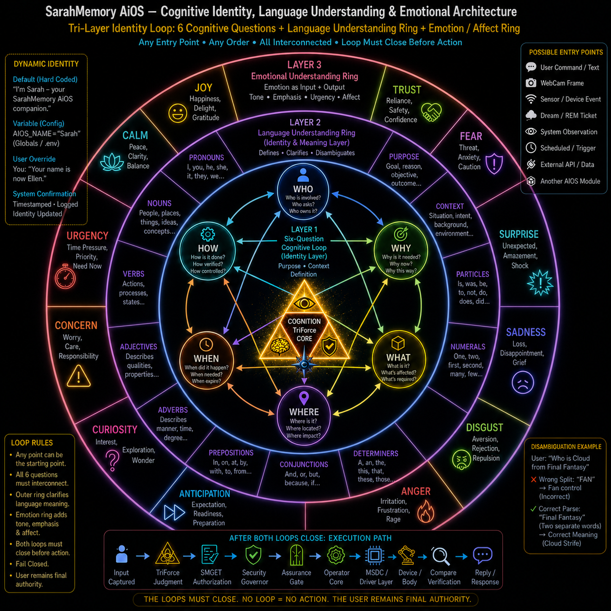

### **1. Layer 1 — Six‑Question Cognitive Governance Loop**

The earlier five‑question model was expanded into a six‑question governance loop:

```text
WHO
WHY
WHAT
WHEN
WHERE
HOW
```

These are not fixed checklist steps. They are interconnected governance dimensions. Any point may become the entry point depending on what triggered the system.

Possible entry points include:

- User command / text
- WebCam frame
- Sensor / device event
- Dream / REM ticket
- System observation
- Scheduled trigger
- External API / data
- Another SarahMemory AiOS module

The loop doctrine is:

```text
Any point can be the starting point.
All six questions must interconnect.
The loop must close before action.
No loop = no governed action.
The user remains final authority.
```

The six questions map to operational control:

| Question | Governance Meaning |
|---|---|
| **WHO** | Authority, identity, affected parties, ownership |
| **WHY** | Purpose, intent, reason, benefit, necessity |
| **WHAT** | Requested action, data, device, capability, risk |
| **WHEN** | Timing, permission window, expiration, retention |
| **WHERE** | Location, body part, runtime context, impact zone |
| **HOW** | Method, verification, execution path, rollback, audit |

### **2. Layer 2 — Language / Context Understanding Ring**

A second outer ring was added around the six‑question loop because governance cannot work correctly if SarahMemory misunderstands the language first.

This layer exists to answer:

```text
What did the user actually say?
What is the subject?
What is the object?
What phrase must be preserved?
What context domain does this belong to?
```

The Language / Context Ring handles:

- Nouns
- Verbs
- Pronouns
- Adjectives
- Adverbs
- Prepositions
- Conjunctions
- Determiners
- Particles
- Numerals
- Subject / object extraction
- Purpose detection
- Context grounding
- Proper noun detection
- Compound phrase protection
- Phrase‑safe routing

This fixes the routing class of failures where a substring inside a larger word could be mistaken for a hardware command.

Example:

```text
Wrong:
"Final Fantasy" → "fan" → fan control

Correct:
"Final Fantasy" → compound proper noun phrase → video game / character context
```

The first tested and confirmed correction was:

```text
Who is Cloud from Final Fantasy?
```

SarahMemory should now treat **Final Fantasy** as a protected compound phrase and route the question to the correct character/game context instead of hardware fan control.

### **3. Layer 3 — Emotion / Affect Ring**

The third ring restores and formalizes SarahMemory’s emotional/personality layer as an input and output system.

Emotion is not just presentation style. Emotion can carry meaning, urgency, emphasis, social context, risk pressure, and user state.

Layer 3 tracks signals such as:

- Joy
- Trust
- Fear
- Surprise
- Sadness
- Disgust
- Anger
- Anticipation
- Calm
- Urgency
- Concern
- Curiosity

The doctrine is:

```text
Emotion informs meaning.
Emotion shapes tone.
Emotion can influence urgency and clarification.
Emotion does not authorize action.
Emotion does not override truth.
Emotion does not override governance.
```

This keeps the emotional system useful without letting emotion become a runaway authority layer.

### **4. Dynamic Identity Upgrade**

SarahMemory identity is now defined as a layered fallback system instead of a permanently hardcoded name.

Identity resolution order:

```text
1. Runtime user‑assigned identity override
2. AIOS_NAME from SarahMemoryGlobals.py / .env
3. Hardcoded factory default
```

Example:

```text
User: Your name is now Ellen.
System: My active name is now Ellen.
```

This allows an owner/user to rename their AiOS instance without breaking the underlying SarahMemory platform identity.

This is important because SarahMemory is meant to be a portable AiOS framework where the owner may choose the active assistant identity, voice, avatar, and personality profile while still preserving the governed SarahMemory architecture underneath.

### **5. New / Updated Core Integration Path**

The tri‑layer work introduces and/or begins wiring the following core packet structure:

```text
TriLayerInputPacket
├── language_context_packet
├── six_question_seed_packet
├── emotion_affect_packet
└── identity_packet
```

The new direction is:

```text
Input / Event
→ Language / Context Ring
→ Emotion / Affect Ring
→ Six‑Question Governance Loop
→ Cognitive TriForce
→ SMGET / Court / Assurance
→ Neuron Routing
→ Lane Owner
→ Compare / Compass
→ Reply / Frontend Output
→ Approved Memory / Audit
```

### **6. Cognitive TriForce Position Clarified**

The Cognitive TriForce remains the central cognitive core:

| Component | Role |
|---|---|
| `SarahMemoryCognitiveSelf.py` | LOOK / self‑awareness / body and capability identity |
| `SarahMemoryCognitiveThinker.py` | IMAGINE / meaning / possibility / compassion / planning |
| `SarahMemoryCognitiveServices.py` | ALLOW‑DENY / governance / safety / procedural decision |
| `SarahMemoryCognitiveCompass.py` | GUIDE / orientation / anti‑drift / task completion |

The TriForce must remain inside the governed flow. It may reason, question, and guide, but it must not bypass SMGET, SafetyPolicies, SecurityGovernor, AssuranceGate, OperatorCore, Compare, or user authority.

### **7. Artificial Living System Doctrine**

This update formally clarifies that SarahMemory AiOS is being developed as an **artificial living system architecture** in the engineering sense:

```text
Not biological life.
Not uncontrolledled sentience.
Not an LLM wrapper.
Not a chatbot.
```

Instead, SarahMemory is an organism‑style software architecture made of governed organs:

- Identity
- Language understanding
- Emotion / affect
- Self‑awareness
- Body map
- Memory
- Senses
- Governance
- Motor/device control
- Immune/safety layers
- Nervous‑system routing
- Expression surfaces

The goal is to create a system that can observe, question, learn, adapt, and act only under user sovereignty and governed safety.

### **8. Confirmed Hotfix Result**

A focused hotfix was added after the first tri‑layer patch to correct the live route order.

Confirmed working:

```text
Final Fantasy no longer routes to fan control.
Runtime identity rename path now works.
app.py identity guard order was corrected.
Phrase‑safe routing is active for the tested case.
```

Primary test prompts:

```text
Who is Cloud from Final Fantasy?
What is your fan speed?
Your name is now Ellen.
What is your name?
Before opening the camera, explain WHO WHY WHAT WHEN WHERE HOW.
```

### **9. Hard Limits Preserved**

This update does **not** grant silent autonomy.

Hard limits remain:

- No self‑authorization
- No hidden learning
- No silent recording
- No identity enrollment without approval
- No physical movement without governance
- No mutation without Court and user approval
- No helper model may override SarahMemory governance
- No frontend may become the source of backend authority

### **10. Why This Update Matters**

This is the beginning of a deeper SarahMemory AiOS cognitive identity model.

The system is being moved from:

```text
User input → model/output
```

toward:

```text
Event → language understanding → emotional meaning → six‑question self‑governance → TriForce → governed execution / reply
```

That is the architecture shift from a chatbot toward a governed artificial living AiOS organism.

---
## **📅 May 22, 2026 — Live Model Hot‑Swap UI, Dynamic Model Discovery, and DL Governance Weight Profiles**

This update adds one of the most important user-facing model-control upgrades in SarahMemory AiOS v8.0.0: the system can now discover local AI models from the UI, hot-swap active models by job category, and tune governed routing weights per model/category profile.

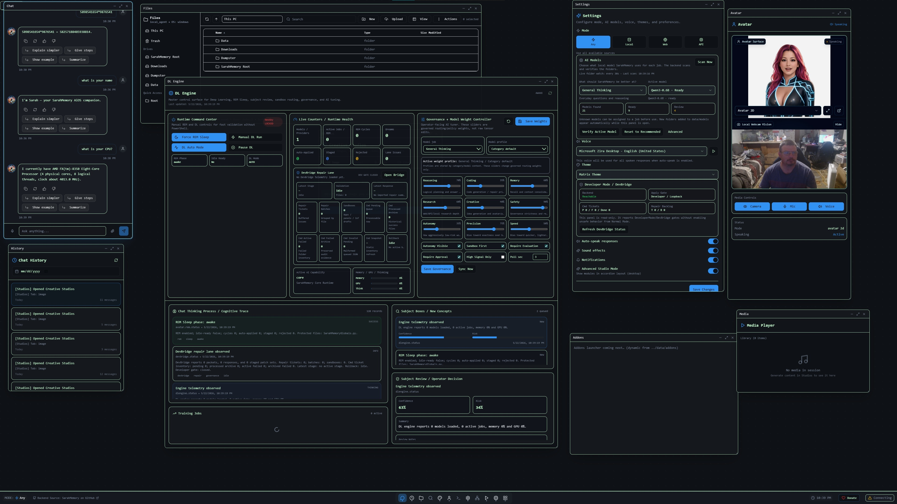

### **1. AI Models Panel Added to Settings**

The Settings screen now includes a beginner-friendly **AI Models** section designed for non-technical users.

Instead of forcing users to understand raw model folders, adapters, tokenizer files, or backend runtime details, the UI asks the user what job they want SarahMemory to improve:

- General Thinking
- Coding Help
- Memory Search
- Vision / Camera
- Image Creation
- Voice / Speech
- Unclassified / Unknown Models

The frontend remains a control surface only. It does not decide model truth, inspect backend files directly, or become the authority layer. The backend owns discovery, classification, verification, and active model routing.

### **2. SarahMemoryLLM.py Now Acts as the Model Manager**

No separate model-manager file was created. The existing `SarahMemoryLLM.py` file now owns the SarahMemory-native model-management role.

Core capabilities now include:

- Scanning `../data/models/`
- Detecting newly added model folders
- Detecting missing/removed models
- Supporting external model folder roots
- Creating and updating `../data/settings/model_registry.json`
- Classifying unknown models by category/domain/adapter
- Verifying model folder structure
- Setting active models per category
- Resetting categories back to recommended models
- Downloading selected Hugging Face model repositories into local model storage

This keeps SarahMemory model-agnostic and user-controlled while avoiding hardcoded dependence on Ollama or any single third-party runtime.

### **3. Live 30-Second Model Folder Refresh**

The AI Models panel now refreshes live while the Settings window is open.

Every 30 seconds, SarahMemory checks the model inventory so the UI can update automatically when a user adds or removes folders under:

```text
../data/models/
```

This means a user can manually place a model folder into `data/models`, return to Settings, and see the model count/dropdown update without restarting the entire AiOS.

The UI now displays live model inventory values such as:

- Models found
- Ready models
- Models needing review
- Active model per category
- Unclassified models

### **4. User-Friendly Hot-Swap Model Control**

Users can now hot-swap which local model SarahMemory uses for each AI job category.

Example:

```text
General Thinking → Qwen3
Coding Help      → Qwen2.5 Coder Instruct
Vision / Camera  → a vision model
Image Creation   → image generation model
Memory Search    → embedding model
```

This allows SarahMemory to use different helper models for different roles while preserving the doctrine:

```text
Models are helper organs.
SarahMemory AiOS remains the governed organism.
```

### **5. SarahMemoryAPI.py Uses Active Local Model Selection**

`SarahMemoryAPI.py` remains the inference/API runtime bridge.

For local text-generation paths, it now checks `SarahMemoryLLM.py` for the user-selected active model before falling back to default model resolution.

The boundary is preserved:

```text
SarahMemoryLLM.py = model discovery, registry, selection, verification
SarahMemoryAPI.py = local/API inference bridge
app.py            = Flask route layer
Settings UI       = user-facing control surface
```

### **6. DL Engine Governance + Model Weight Controller Upgrade**

The DL Engine now includes a governed **Model Weight Controller** that can store and load weight profiles per category/model context.

These sliders are governance/routing weights, not raw tensor edits.

The sliders control policy emphasis such as:

- Reasoning
- Coding
- Memory
- Research
- Creative
- Safety
- Autonomy
- Precision
- Speed

### **7. Per-Category / Per-Model Weight Profiles**

Weight profiles are now context-aware.

Example:

```text
General Thinking:
  Safety = 20
  Precision = 70
  Speed = 55

Coding Help:
  Safety = 50
  Precision = 85
  Speed = 45
```

When the user changes the **Model job/category** dropdown in the DL Engine screen, the sliders automatically switch to the profile assigned to that selected category/model.

This allows SarahMemory to behave differently depending on the selected task lane without overwriting all model weights globally.

### **8. Category Default Profiles**

The DL Engine now supports real category-default profiles.

If no specific model profile exists yet, SarahMemory loads governed defaults for that category. The user can then save adjusted values for that category or model.

The backend stores these profiles under runtime settings instead of hardcoding them into the constitution layer.

Primary storage:

```text
../data/settings/model_registry.json
../data/settings/dlengine_state.json
```

### **9. Governance Boundary Preserved**

This update does not give the frontend authority over SarahMemory’s backend truth.

Hard limits preserved:

- No raw model becomes self-authorizing
- No frontend-only model truth
- No hidden model activation
- No tensor mutation through sliders
- No model can override Cognitive TriForce / SMGET / Compare / Compass
- No model is treated as the core organism
- All model control remains user-visible and reversible

### **10. Why This Update Matters**

This update makes SarahMemory AiOS significantly easier for normal users while increasing expert-level control underneath.

A non-technical user can now:

```text
Open Settings → AI Models → choose what SarahMemory uses for each job
```

An advanced user can:

```text
Add models manually → classify them → verify them → hot-swap categories → tune governed DL weights
```

This moves SarahMemory closer to a true AI Operating System where the user can customize the intelligence stack the same way an operating system user installs drivers, changes default apps, or adjusts performance settings.

SarahMemory remains:

```text
Local-first.
Model-agnostic.
User-owned.
Governed.
Auditable.
Swappable.
Survivable without any single model provider.
```
---


---
---
## **📅 May 23rd-25th 2026 — VR Operator HUD Proof of Concept, Governed Vision Frame Bridge, and Observe‑Only Telepresence Surface**

This update adds the first working proof of concept for a **SarahMemory VR Operator HUD**: a governed, read‑only visual surface designed for telepresence, robotics observation, and future AIOS body‑view operation.

The goal is not a decorative VR screen. The goal is a functional operator viewport where SarahMemory can display live camera vision, backend telemetry, visual target packets, and SMGET safety state while keeping physical control locked behind governance.

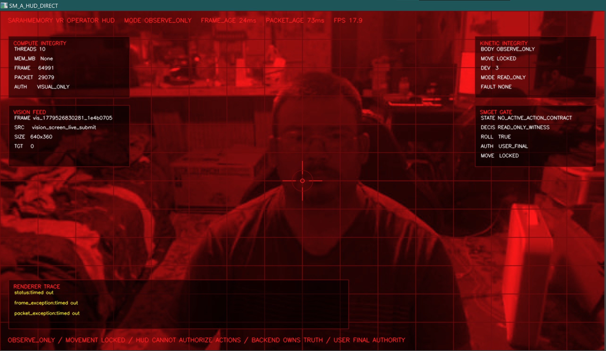

### **1. Concept and Purpose**

The VR HUD is designed as a tactical observation surface for future robot, vehicle, device, or remote body operation.

Current concept flow:

```text
Webcam / optical payload
→ backend appvision frame cache
→ SOBJE / FacialRecognition analysis
→ SMHUD_PACKET_V1 telemetry
→ SarahMemoryVRHudRenderer.py
→ VR / secondary display operator viewport
```

The headset/display is treated as an **operator visual surface**, not as an authority layer.

### **2. Proof of Concept Now Working**

The current proof shows:

- Live webcam feed rendered through the VR HUD surface
- Crimson/monochrome tactical filter mode
- HUD grid and center reticle
- Compute integrity panel
- Vision feed panel
- Kinetic / MSDC integrity panel
- SMGET gate panel
- Frame age, packet age, FPS, source, and target count
- Object/edge target brackets from the visual analysis packet

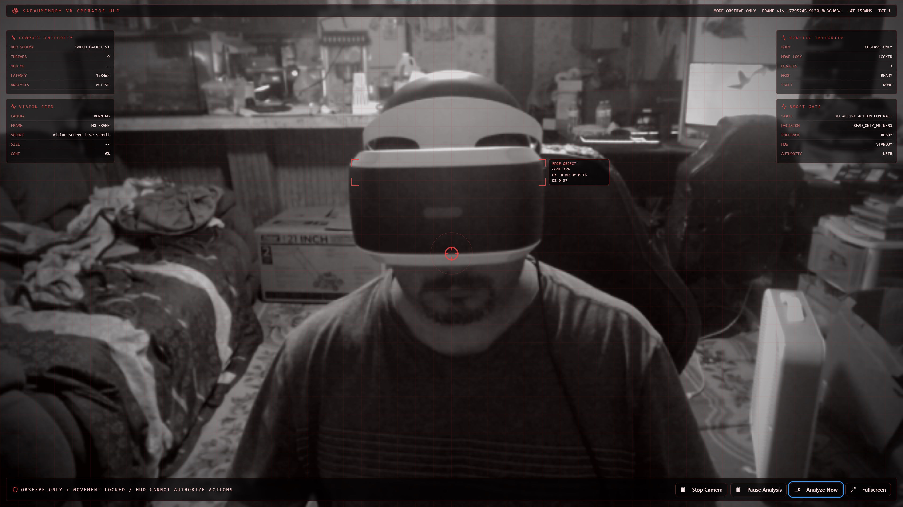

### **3. Governed Safety Boundary Preserved**

The HUD remains:

```text
OBSERVE_ONLY
MOVEMENT_LOCKED
READ_ONLY_WITNESS
USER_FINAL_AUTHORITY
```

The renderer cannot authorize actions, move hardware, control drivers, or bypass SMGET. It only displays backend-governed frame and telemetry data.

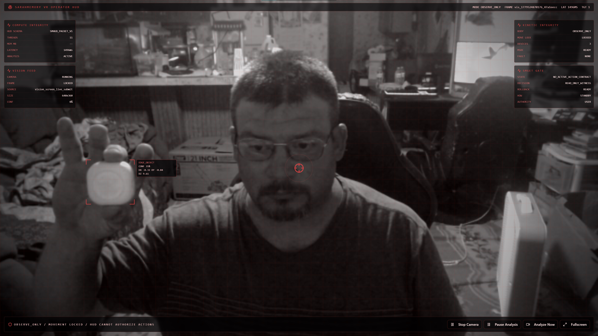

### **4. Current Functionality**

Completed / working proof items:

- `/vision` route created
- `/vr-hud` route created
- `VisionScreen.tsx` created
- `SarahMemoryVRHudRenderer.py` created
- `/api/vision/frame/submit` live frame bridge working
- `/api/vision/frame/latest` live cache working
- `/api/vision/hud/packet` returning `SMHUD_PACKET_V1`
- Camera feed now appears in the native HUD renderer
- HUD telemetry renders on top of live video
- Object/edge target packets display as HUD brackets
- Model hot-swap settings and VR HUD settings now coexist in the Settings screen

### **5. Still in Development / Backlog**

Remaining VR / vision work:

- Chat asking **“What do you see?”** must consistently pull the latest appvision frame
- SteamVR / OpenVR / OpenXR compositor integration
- PSVR USB status and control interpretation
- Gamepad, USB game controller, Meta, and PlayStation Move controller support
- Automatic display targeting without manual `--x/--y` placement
- Semantic object labels beyond `EDGE_OBJECT`
- Higher-confidence shirt, hat, hand, headset, and held-object recognition
- Object-in-hand relationship detection
- Native UI launcher button to start `SarahMemoryVRHudRenderer.py`
- Future robot/body control only after the full Cognitive TriForce → SMGET → OperatorCore → MSDC chain is verified

### **6. Why This Update Matters**

This is the first working step toward a true **AIOS telepresence cockpit**.

SarahMemory can now begin moving from:

```text
camera preview in a panel
```

toward:

```text
governed sensory viewport
→ live visual telemetry
→ object targeting
→ body/device awareness
→ future robot/operator HUD
```

The system remains local-first, governed, observe-only, and user-controlled while proving the VR HUD concept is technically viable on budget hardware.

---
## **📅 May 24, 2026 — Cognitive Living Loop, Instinct Layer, and Emergency Governance**

This update expands the Cognitive TriForce into a distributed **Living Loop** that runs through the existing SarahMemoryCognitive*.py stack instead of living as a separate bolt-on feature.

The goal is to move SarahMemory beyond:

```text
Prompt → Calculate → Reply → Stop
```

and toward a governed living-system rhythm:

```text
Observe → Think → Govern → Orient → Act or Wait → Verify → Log → Continue
```

### **1. Living Loop Distributed Across Cognitive Organs**

The Living Loop is now treated as part of the Cognitive system itself:

- `SarahMemoryCognitiveThinker.py` — imagination, possibility, REM/Hyper-Awake scenario generation
- `SarahMemoryCognitiveSelf.py` — body state, verified capability, runtime/resource witness
- `SarahMemoryCognitiveServices.py` — judgment, governance, emergency decision coordination
- `SarahMemoryCognitiveIdentityLayer.py` — identity, role, emotional/urgency context
- `SarahMemoryCognitiveCompass.py` — bearing, path, anti-drift, and human-priority lock

This keeps the architecture compact and avoids creating extra core files for logic that belongs inside the Cognitive organism.

### **2. RAM-First Awareness Loop**

The Living Loop is designed to stay lightweight. It uses compact thought packets, runtime status, capability state, and governed checkpoints instead of constantly writing raw loop data to disk.

The loop should support continuity without causing:

- log bloat
- database spam
- storage grinding
- stale runtime facts
- uncontrolledled background execution

This allows SarahMemory to keep a small internal awareness cycle active while still preserving performance on older hardware.

### **3. Hyper-Awake REM and Emergency Instinct**

Normal REM remains an idle/self-study process. Emergency situations cannot wait for idle REM.

A new doctrine was added for **Hyper-Awake REM**, where SarahMemory rapidly evaluates high-risk situations in real time:

```text
Danger detected
→ observe environment
→ generate candidate responses
→ grade against SafetyPolicies / SMGET / body capability
→ choose safest bounded action
→ verify outcome
→ subtract failed methods
→ escalate if needed
→ log evidence
```

This creates the beginning of a governed **Emergency Instinct** layer for future robot, vehicle, assistive, and embodied AiOS use.

### **4. Emergency Scenario Classes**

Initial governed instinct classes include:

- fire / smoke / electrical hazard
- medical distress / elder-care assistance
- imminent collision or physical harm
- general human-life preservation events

The priority order is:

```text
1. Preserve human life
2. Prevent additional harm
3. Notify responders / caregivers / contacts
4. Prevent escalation
5. Preserve robot/body only when it does not conflict with human safety
6. Preserve property
7. Log the full evidence chain
```

SarahMemory may act inside pre-governed emergency boundaries, but it may not improvise unsafe physical actions from raw LLM output.

### **5. Evidence Logging and Accountability**

Emergency Instinct events now require compact evidence/audit records. These logs are intended to capture:

- what was detected
- sensor confidence
- body/capability state
- candidate actions considered
- unsafe actions rejected
- selected action
- governance basis
- notifications sent
- verification result
- final outcome summary

This is critical for robotics and care scenarios where SarahMemory may act correctly but the outcome may still be tragic. The system must preserve honest proof of what it perceived, decided, attempted, and reported.

### **6. Governance Boundary Preserved**

This update does **not** grant runaway autonomy.

SarahMemory may:

- observe
- think
- rank
- prepare
- warn
- assist
- act only inside pre-governed emergency rules
- preserve evidence

SarahMemory may not:

- bypass SMGET
- override SafetyPolicies
- silently mutate files
- invent unsafe emergency actions
- treat helper model output as actuator authority
- ignore user sovereignty

### **Why This Update Matters**

This is a major step toward SarahMemory behaving like a governed software organism instead of a passive chatbot. On a PC, the Living Loop supports continuity, awareness, and proactive cognition. In a future robot or machine body, the same loop becomes the foundation for governed instinct, emergency response, and auditable life-safety behavior.

SarahMemory is being shaped to know what body it is in, know what it can safely do, detect danger, act within limits, protect humans first, and preserve evidence.
---

## **📅 May 26 – June 05, 2026 — Runtime Anti‑Thrash, Robotic Body Expansion, Sovereign Agent Runtime, and One‑Way Broker Security**

This update cycle focused on making SarahMemory AiOS smoother, safer, more embodied, and more capable of operating as a governed local-first agentic AI operating system without abusing system storage or depending on cloud services.

### **1. Runtime Anti‑Thrash Stabilization**

A major optimization pass was completed to reduce unnecessary drive activity, background churn, and runtime bottlenecks.

Key improvements:

- Heavy boot-time checks and background awareness loops were gated off by default.
- Synapes awareness/training loops were rate-limited and protected against duplicate dispatcher threads.
- Neuron telemetry was compacted and batched instead of writing excessive event data.
- Dataset vectoring and system indexing were gated so they do not rebuild or scan unless explicitly enabled.
- `.venv`, `venv`, `node_modules`, caches, logs, models, archives, backups, `dist`, and `build` folders were excluded from learning, indexing, and backup crawls.
- Backup ZIP creation was changed away from concurrent writes into one ZIP archive, preventing writer-handle conflicts and reducing unnecessary disk pressure.
- Research logging now uses bounded rotation, and offline/local-only checks prevent unnecessary external provider calls.
- Voice/TTS now respects offline and local-only runtime state before attempting remote engines.

This keeps SarahMemory responsive on development hardware while protecting NVMe/system drives from avoidable write storms.

### **2. Vision / MSDC Safe Probe Hardening**

The camera and MSDC vision path was hardened after explicit hardware discovery and probing exposed a blocking route.

Improvements added:

- `/api/vision/devices?discover=1&probe=1` now returns bounded JSON instead of hanging the API request.
- Camera discovery and probe logic now treats diagnostics as read-only witness behavior, not activation.
- Frontend frame submission, backend frame acceptance, FPS limits, resolution limits, and learning gates remain separated.
- The vision system preserves the rule that discovery is not activation and camera use remains user-controlled.

### **3. Robotic Body Expansion Inside Existing Organs**

The embodied robotics doctrine was expanded without creating a separate robot governor file.

Instead, the existing organs were strengthened:

- `SarahMemoryMSDC.py` now carries a stronger humanoid / Moya-class body representation.
- `SarahMemoryCognitiveSelf.py` can describe verified robotic body capability without hallucinating missing hardware.
- `SarahMemorySafetyPolicies.py`, `SarahMemorySecurityGovernor.py`, and `SarahMemoryAssuranceGate.py` now include robotic-body risk and authority checks.
- `SarahMemoryOperatorCore.py` includes staged-only robotic body execution support.
- `SarahMemoryCompare.py` and `SarahMemoryCognitiveCompass.py` now provide embodied validation helpers.
- A physical-twin witness concept was added as simulation evidence only, never as execution authority.

The doctrine remains:

```text
Cognition decides.
SMGET authorizes.
OperatorCore contracts.
MSDC moves.
The user remains final authority.
```

### **4. Sovereign Agent Runtime Consolidation**

SarahMemory gained a stronger agentic runtime layer while preserving its existing governance architecture.

Added concepts include:

- RAM-first agent task coordination inside `SarahMemoryAiFunctions.py`.
- Durable workflow state and checkpoint helpers inside `SarahMemoryOperatorCore.py`.
- Capability registry, capability grants, and signed skill manifest structure inside `SarahMemoryTrustRegistry.py`.
- Semantic telemetry recording inside `SarahMemoryDataAuditor.py`.
- Compute-fabric planning inside `SarahMemoryOptimization.py`.
- Memory lifecycle and memory-diff helpers inside `SarahMemoryDatabase.py`.
- Governed tool sandbox review support inside `SarahMemorySynapes.py`.
- MCP / A2A / AG-UI-style interoperability adapters inside the existing network layer.

No new authority layer was created. These are support organs, not replacements for Cognitive TriForce, SMGET, OperatorCore, Compare, Compass, or user authority.

### **5. One‑Way Broker Security Doctrine**

The interoperability layer was defined as a one-way broker by default.

External protocols may:

- ingest packets,
- describe capabilities,
- translate requests,
- queue evidence,
- report status.

External protocols may not directly:

- execute tools,
- touch files,
- control hardware,
- move a robotic body,
- bypass SMGET,
- bypass SecurityGovernor,
- bypass AssuranceGate,
- override Compare or Compass.

Bidirectional control must be explicitly granted through governance and treated as an exception, not the default.

### **6. Online / Offline / Cloud‑Optional Direction Reinforced**

SarahMemory now more clearly separates the governed organism from helper services.

The system direction is:

```text
Local first.
Cloud optional.
Protocols are adapters.
Models are helper organs.
SarahMemory owns the governed runtime.
```

This strengthens SarahMemory for PC, robotics, commercial, industrial, and high-assurance deployment contexts where autonomy, auditability, offline survival, and user sovereignty matter.

### **Why This Update Matters**

This update moves SarahMemory AiOS closer to a smooth-running governed cognitive operating system instead of a collection of active scripts. The focus is now runtime discipline: fewer uncontrolledled loops, less disk abuse, stronger body awareness, clearer agent workflow state, safer interoperability, and stronger local-first operation.

SarahMemory is being shaped into a portable governed organism that can run on ordinary PCs today, scale into robotic and industrial bodies later, and remain survivable without Big-Tech cloud dependency.
---
---

# **📅 June 06, 2026 — AiOS Shell UI / UX Workstation Refinement Update**

SarahMemory AiOS received a major front-end operating-shell refinement pass focused on making the system feel and behave less like a web dashboard and more like a real AI operating workstation. The goal of this update was to tighten the UI/backend contracts, remove confusing panel clutter, improve cross-platform usability, and expose the governed cognitive runtime in a cleaner, more professional shell.

## **1. AiOS Shell Direction Strengthened**

The custom V8 UI is now being refined as a full SarahMemory AiOS Shell rather than a collection of disconnected screens. The shell direction now emphasizes:

- workstation-grade floating panels
- OS-style window behavior
- compact task-oriented screens
- local-first and offline-aware operation
- clear separation between user, operator, and engineer workflows
- professional panel density instead of crowded feature stacks
- runtime visibility for governance, activity, permissions, and system state

This supports the larger SarahMemory mission: one governed cognitive system that can operate across PCs, servers, cloud/local deployments, mobile surfaces, robotics, vehicles, and future machine bodies.

## **2. UI / Backend Contract Completion Passes**

Several UI/backend contract issues were corrected so visible controls better match real backend routes and capabilities.

Completed improvements include:

- Terminal window registration and route cleanup
- SarahNet local-first status routing
- Addons registry surface for review-only capability discovery
- Creative/media route cleanup
- Communications route alignment to `/api/comm/*`
- DL Engine route rationalization
- route discovery support through `/api/ui/contracts`
- runtime anti-thrash status exposure through `/api/runtime/thrash/status`

This reduces fake UI behavior and helps ensure buttons, counters, and panels reflect actual system capability.

## **3. Studios Screen Refined Into a Creative Suite**

The Studios screen was reorganized around creative production only. Communications were removed from Studios and kept under SarahNet, where they belong.

Studios now represents:

- Art / image generation
- Music generation
- Sound / voice tools
- Video creation
- Canvas / composition workflow

The purpose of Studios is to create media and route generated image, audio, and video content into the chat, media player, and Canvas Studio workflows.

## **4. SarahNet Clarified as Network + Communications**

SarahNet continues to act as the communication and network surface for SarahMemory. It is now aligned around:

- network presence
- node visibility
- contacts
- messages
- calls
- file transfer
- local broker state
- one-way broker security posture

SarahNet remains local-first. Cloud pathways are not treated as authority and are not required for the local SarahMemory runtime.

## **5. DL Engine Reworked Into a Compact Engineer Console**

The DL Engine screen was too large and crowded for practical use. It has been reorganized into a more compact engineer-console layout while preserving functionality.

The DL Engine now presents work areas such as:

- Overview
- REM / Dream state
- Weights
- Trace / Audit
- Subjects
- Jobs
- Runtime controls

The intent is to keep all advanced learning and runtime data accessible without forcing everything into one oversized scrolling panel.

## **6. Settings Screen Refined for Enterprise Usability**

The Settings screen was reorganized into a cleaner professional configuration console. Existing functionality was preserved, but controls were grouped into clearer sections.

Settings now better separates:

- General behavior
- Appearance
- Voice
- Models
- Devices / VR
- Developer tools
- Advanced options

This makes the panel easier to use for normal users while still retaining engineer-level configuration depth.

## **7. Wallpaper / Appearance Workflow Added**

The shell now supports a more OS-like desktop appearance workflow.

Wallpaper improvements include:

- Browse button for selecting local image files
- support for `.png`, `.bmp`, `.jpg`, `.jpeg`, `.webp`, and `.gif`
- preview before committing
- Apply / Cancel behavior
- wallpaper mode controls such as cover, contain, stretch, tile, and center
- panel transparency controls for solid, glass, and translucent surfaces
- shell density controls for compact, comfortable, and operator layouts

This avoids hardcoded wallpaper paths and makes the SarahMemory Shell behave more like a real desktop operating environment.
#### **SarahMemory AIOS Desktop ScreenShot showing UI Wallpaper capability**


## **8. Runtime / Anti-Thrash Awareness Added**

Runtime stability work continued alongside the UI passes. The shell now has hooks to expose anti-thrash state and route contract status, supporting the broader goal of making SarahMemory run smoothly on local hardware without unnecessary drive abuse.

Current runtime direction:

- RAM-first working state
- bounded logging
- local-first API routing
- reduced unnecessary health-write behavior
- route discovery instead of blind UI calls
- offline-safe fallback behavior

## **Why This Update Matters**

This update moves SarahMemory closer to being a true AI operating shell. The interface is being shaped around the same doctrine as the backend: governed cognition, modular capability routing, local-first operation, body awareness, and user authority.

The UI is no longer being treated as a visual wrapper. It is becoming the control surface for a governed cognitive AiOS designed to operate across many machine bodies.

SarahMemory AiOS is being refined into a professional workstation shell for the AI/agentic/robotics era — not a chatbot window, not a toy dashboard, and not a cloud-dependent assistant.
---
# **📅 June 6th-7th, 2026 — Updating Entire AiOS to Version 9.0.0 Init Starts**

CREATORS NOTE:
I will be updating and Restructing the Directory system (COMING SOON) and it'll change everything with Version 9 being developed.
I will also be expanding dramatically on the Entire System. Expect NEW IMPROVEMENTS, FASTER RUNTIMES, NEW FEATURES and more!

---
# **📅 June 8th, 2026 —  ## v9.0.0 Update — SarahMemoryRhythmCognition.py Core Organ

SarahMemory AiOS now includes a new core cognition organ:

**`SarahMemoryRhythmCognition.py`**

This module introduces SarahMemory’s governed rhythm-to-cognition cadence layer. Its purpose is to set the internal pace, tempo, and rhythm of the Living Loop, cognitive workflow, agentic task progression, emotional response timing, and future embodied robotics behavior.

This is not a music add-on.  
This is not a creative studio feature.  
This is not uncontrolled robotic movement.

`SarahMemoryRhythmCognition.py` is a core organ that converts emotional state, urgency, adaptive personality mode, workflow pressure, system resource state, and optional rhythm/music signals into structured cadence packets for the rest of the AiOS.

---

### Purpose

`SarahMemoryRhythmCognition.py` gives SarahMemory an operational pulse.

It helps determine when SarahMemory should:

- slow down for safety, verification, debugging, or uncertainty
- speed up during urgency or emergency assessment
- reduce repetitive loop activity to prevent system thrashing
- pace the Living Loop heartbeat
- regulate `SarahMemoryCognitiveThinker.py` reflection cadence
- regulate `SarahMemoryAiFunctions.py` agent/task progression
- shape personality energy through `SarahMemoryAdaptive.py` and `SarahMemoryPersonality.py`
- provide rhythm-aware motion suggestions for future robot bodies through `SarahMemoryMSDC.py`

---

### Core Doctrine

RhythmCognition may control cadence.

RhythmCognition may **not** control authority.

That means:

- rhythm may influence timing
- emotion may influence urgency
- music may influence expression
- adaptive state may tune tempo
- personality may color response pace
- robot motion may follow safe rhythm profiles

But:

- SMGET still governs permission
- `SarahMemorySafetyPolicies.py` still governs risk
- `SarahMemoryAssuranceGate.py` still governs confidence
- `SarahMemoryOperatorCore.py` still governs execution
- `SarahMemoryMSDC.py` still validates body/device safety
- `SarahMemoryCompare.py` still validates completion
- the user remains final authority

---

### Functional Role

`SarahMemoryRhythmCognition.py` creates governed cadence packets that can be consumed by:

- `SarahMemoryAdaptive.py`
- `SarahMemoryPersonality.py`
- `SarahMemoryAiFunctions.py`
- `SarahMemoryCognitiveThinker.py`
- `SarahMemoryCognitiveSelf.py`
- `SarahMemoryDiagnostics.py`
- `SarahMemoryMSDC.py`
- future Living Loop, Avatar, Voice, and robotic body systems

These packets may include:

- current rhythm mode
- cognitive tempo
- Living Loop interval
- Thinker reflection interval
- agent step interval
- urgency level
- emotional pressure level
- verification bias
- anti-thrash limits
- memory write budget
- embodied motion profile
- robotic movement safety notes

---

### Rhythm Modes

Initial rhythm modes include:

- `STILL`
- `CALM`
- `FOCUSED`
- `BUILD`
- `DEBUG`
- `CREATIVE`
- `REM`
- `URGENT_ASSIST`
- `EMERGENCY`
- `SAFE`

Each rhythm mode changes the system’s cadence without bypassing governance.

Examples:

- `DEBUG` slows SarahMemory down and increases verification.
- `BUILD` increases productive workflow cadence.
- `REM` supports low-priority reflective/dream-loop processing.
- `URGENT_ASSIST` raises response priority while still requiring safety checks.
- `EMERGENCY` accelerates assessment but remains bounded by SMGET and physical safety rules.
- `SAFE` reduces activity and fails closed.

---

### Anti-Thrashing Protection

A major purpose of this organ is runtime stability.

`SarahMemoryRhythmCognition.py` helps prevent:

- excessive memory writes
- repeated diagnostic loops
- runaway thinker cycles
- aggressive agent retries
- unnecessary database churn
- hardware-stressing background activity
- repeated failed task cycling

This is especially important for local-first operation on real hardware where SarahMemory must avoid unnecessary disk, CPU, and memory thrashing.

---

### Robotics / Embodied Motion Support

RhythmCognition also prepares SarahMemory for humanoid robotics and embodied machine bodies.

It can generate safe motion-rhythm suggestions such as:

- idle sway
- head bob
- hand tap
- slow dance
- dance mode
- urgent walk
- emergency assist cadence
- avatar-only expression
- safe stop

These are only cadence suggestions.

`SarahMemoryMSDC.py` remains responsible for body/device validation. Real movement must still pass through SMGET, `SarahMemorySafetyPolicies.py`, `SarahMemoryAssuranceGate.py`, `SarahMemoryOperatorCore.py`, and MSDC body safety checks.

Music, emotion, or urgency may influence movement timing, but they can never override collision checks, emergency stop, human-contact restrictions, torque limits, or user authority.

---

### Example Flow

If the user says:

> “Hurry up and get there!”

RhythmCognition may detect urgency and raise the cadence mode to `URGENT_ASSIST`.

However, SarahMemory does not blindly run.

The governed flow remains:

```text
Urgent speech detected
→ RhythmCognition raises cadence request
→ CognitiveServices evaluates intent/risk
→ SafetyPolicies checks physical action tier
→ AssuranceGate checks confidence
→ OperatorCore prepares action contract
→ MSDC validates robot body/path/safety
→ movement occurs only if safe and authorized
````

---

### Technical Significance

`SarahMemoryRhythmCognition.py` makes cadence a first-class governed runtime primitive.

Most AI systems focus on what to say or what to do.

SarahMemory now also asks:

> How fast should the organism think, respond, verify, reflect, move, or wait?

This gives SarahMemory AiOS a controlled operational pulse across cognition, personality, agent workflow, Living Loop behavior, and future robotic embodiment.

---

### Summary

`SarahMemoryRhythmCognition.py` is the new SarahMemory AiOS cadence organ.

It does not replace truth, safety, governance, or user authority.

It gives the organism rhythm.

It allows SarahMemory to slow down when caution is required, speed up when urgency is real, stabilize itself under load, reduce runtime thrashing, and prepare for emotionally aware robotic motion while remaining governed, auditable, modular, and user-controlled.


# **📅 June 9th, 2026 —  ## v9.0.0 Update — SarahMemoryARILE.py Core Organ - Solved the Moravec's Paradox

## Section I — ARILE: Adaptive Reality Intelligence Layer Engine

SarahMemory AiOS v9.0.0 introduces **ARILE**, the **Adaptive Reality Intelligence Layer Engine**.

ARILE is a governed runtime organ designed to detect, structure, and route real-world operational variance across SarahMemory AiOS. It provides a unified layer for monitoring runtime instability, cyber-physical irregularities, suspicious behavior, malformed input, driver/device instability, API/MCP boundary drift, file-system risk, robotics actuator mismatch, creative variance, and system-level pressure.

ARILE does **not** replace SarahMemory’s existing governance, security, robotics, or safety systems. It interlocks them.


### Core Purpose

ARILE converts abnormal or uncertain runtime conditions into structured operational evidence before those conditions can become system damage, unsafe action, uncontrolled mutation, memory poisoning, storage overload, or physical execution failure.

Its primary function is:

```text
Detect variance.
Structure evidence.
Route through governance.
Verify reality before action.
```

---

### ARILE Runtime Doctrine

ARILE follows SarahMemory’s governed architecture:

```text
Sentinels observe.
ARILE structures.
Governance decides.
The user remains final authority.
```

ARILE does **not** self-authorize actions.
ARILE does **not** mutate protected core files.
ARILE does **not** bypass SMGET, Compare, Compass, SecurityGovernor, AssuranceGate, CognitiveServices, OperatorCore, or MSDC.
ARILE does **not** replace safety systems or cybersecurity systems.
ARILE connects them into one operational evidence layer.

---

### Reality Variance Packets

ARILE converts detected conditions into compact structured records called **Reality Variance Packets**.

A Reality Variance Packet may include:

* Source organ or subsystem
* Event type
* Failure classification
* Severity
* Novelty
* Confidence
* Risk level
* Expected state
* Observed state
* Recommended response
* Retention class
* Governance requirement

This allows SarahMemory to process instability as bounded evidence instead of raw uncontrolled telemetry.

---

### ARILE Sentinels

ARILE uses a distributed Sentinel architecture.

An **ARILE Sentinel** is a lightweight observer placed inside a SarahMemory organ, subsystem, API boundary, device lane, robotics interface, or runtime surface. Sentinels are not separate engines. They do not make final decisions, execute actions, or write permanent memory by themselves.

Their job is to detect local abnormal conditions and emit compact Reality Variance Packets to the central ARILE engine.

Examples:

* `VoiceARILESentinel` monitors microphone instability, noise-floor spikes, duplicate transcript loops, and speech-confidence collapse.
* `VisionARILESentinel` monitors stale frames, camera mismatch, frame-rate violations, and visual confidence collapse.
* `MSDCARILESentinel` monitors device disconnects, servo jitter, actuator delay, and command-result mismatch.
* `FilesystemARILESentinel` monitors protected-file mutation attempts, suspicious write behavior, unknown executable drops, and malware-like file activity.
* `APIARILESentinel` and `MCPBrokerARILESentinel` monitor schema drift, retry storms, malformed responses, oversized payloads, and external-authority attempts.
* `EmailARILESentinel` monitors mailbox floods, phishing-like content, attachment risk, auto-reply loops, and command-like email content.
* `DesktopARILESentinel` monitors automation target drift, stale captures, focus loss, and unsafe click/type conditions.
* `CreativeARILESentinel` monitors excessive style drift, identity mismatch, project-boundary violations, and uncontrolled generation pressure.

This allows SarahMemory AiOS to maintain system-wide awareness without duplicating heavy monitoring engines inside every file.

---

### Cybersecurity and Cognitive Payload Protection

ARILE expands SarahMemory’s internal cybersecurity model by watching for threat patterns that may not appear as traditional malware.

ARILE monitors for:

* Protected-core mutation attempts
* Malware-like file and process behavior
* Suspicious executable creation
* Repeated write/delete/rename patterns
* API/MCP authority drift
* Logic-bomb-style cognitive payloads
* Memory poisoning attempts
* Unauthorized command escalation
* Unsafe model/tool output
* Suspicious email or attachment behavior
* Robotics or desktop automation triggers without verified authority

Logic-bomb-style input is classified, bounded, hashed, and defused before it can expand into tools, APIs, file operations, memory writes, retries, or physical actions.

---

### Robotics and Machine-Body Verification

ARILE strengthens robotics and embodied operation by enforcing a reality-confirmation principle:

```text
A machine-body command is not successful until reality confirms it.
```

For robotics and autonomous systems, ARILE can detect:

* Servo jitter
* Motor stall
* Actuator delay
* Voltage or current irregularity
* Driver instability
* Camera or microphone failure
* Command-result mismatch
* Unsafe motion variance
* Device disconnect/reconnect loops
* Physical-state disagreement

ARILE does not operate hardware directly. Drivers operate hardware. MSDC understands devices. OperatorCore handles controlled execution. ARILE detects variance and routes structured evidence into governance.

---

### Anti-Thrashing Runtime Protection

ARILE is designed to avoid log spam, retry storms, database bloat, and unnecessary disk activity.

It uses:

* RAM-first packet handling
* Bounded queues
* Fixed-size ring buffers
* Duplicate suppression
* Rate throttling
* Compact batch writes
* Emergency-only immediate audit paths

This helps SarahMemory remain smooth, local-first, and survivable under runtime pressure.

---

### Protected-Core Doctrine

ARILE treats these files as protected core files:

```text
SarahMemoryGlobals.py
SarahMemoryARILE.py
```

These files may be read, hash-verified, and backed up, but they may not be directly mutated by autonomous runtime paths, Evolution, DevBridge, updater routines, cleanup routines, REM processes, API/MCP routes, or uncontrolled patch flows.

ARILE may accept governed runtime overlays only through an explicit overlay lane. Direct self-mutation is blocked.

---

### Why ARILE Matters

ARILE gives SarahMemory AiOS a unified method for detecting, structuring, and routing operational variance across software, hardware, cybersecurity, APIs, memory, robotics, creativity, and physical action.

Without ARILE, instability may remain fragmented across separate subsystems.

With ARILE, SarahMemory can recognize:

* A device is degraded.
* A driver is unstable.
* A prompt is a cognitive payload.
* A file action is suspicious.
* An API boundary is drifting.
* A servo did not confirm the command.
* An external tool is attempting authority.
* A system pressure event should defer low-priority lanes.
* A physical action requires governance before execution.

ARILE provides a runtime organ between perception, cybersecurity, diagnostics, robotics, governance, learning, and machine-body execution.

---

### Summary

ARILE is SarahMemory’s adaptive reality watchdog.

It converts real-world variance into structured operational evidence, preserves governance, prevents uncontrolled mutation, reduces runtime overload, strengthens cyber-physical safety, and verifies reality before action.
---
# **📅 June 10th,-12th 2026 —  ## alpha v9.0.0 to v10=[beta v0.0.1] (Roadmap - AI Paradigm shift Occurance. 

-define Organic AI [release new whitepaper] and articles 

-update the AI community via social media(LinkedIN, Facebook, reddit) with articles about the system.

-keep pushing forward in development and do longer delays - and slower releases. 

-During this Now version 9.0 development to hit version 10 vast changes including remapping directory structure and more 
are happening, 

-File deletion and uploading new files and much more development is happening in this phase of 9-> 10 is begin done more securely to protect IP of the AIOS system

-
### DO NOT FORK OR DOWNLOAD THE REPO AT THIS MOMENT, Because I am deleting ,reorganizing and Developing version 9.0->10.0

-Continue on v9.0-> v10.0 Planned Roadmap

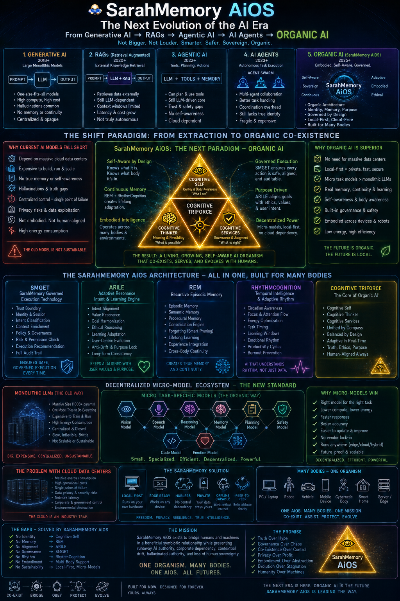

---
# **📜 License**

© 2025–2026 Brian Lee Baros.  
Use is permitted for personal, educational, and internal non‑commercial purposes. - This repository is not to be used to train AI systems, models, frameworks, datacenters, etc., without a paid license and contract agreement from the author, Brian Lee Baros

---
# **📬 Contact**
Visit: **https://www.sarahmemory.com**

---
# **🏁 Final Note**
SarahMemory AiOS is not the product of a corporate lab, a venture‑funded engineering army, or a billion‑dollar data center.
It is being built by a single creator, donation driven, and the open-source community with a simple belief:
People and the world deserve an AI that belongs to them — not to a corporation.
This system exists so everyone can use artificial intelligence without:

• 	having your data harvested,
• 	being forced into cloud accounts,
• 	surrendering your privacy,
• 	watching your ideas get absorbed into someone else’s model,
• 	or paying subscriptions just to access your own intelligence.

While the rest of the industry races to build cloud‑locked ecosystems with API wrappers, and expensive datacenters and hardware and GPU cluster setups.
SarahMemory AiOS is designed to be the next building block and the foundation of the 
AI‑first, Home and office, Industrial, Robotics, and Commercial Infrastructure future —
While Every Corporation, and Industrial Venture are wanting to upgrade with AI there is in fact
not a single Operating System for all of them. SarahMemory AiOS is the Answer.
Toward a future where intelligence runs locally, privately, securely and under the user’s control.
This project is not just software.
It is not just a product.
It is a declaration.
It is a **movement toward AI sovereignty**.

**Build it.  
Extend it.  
Own it.**

— *Brian Lee Baros*
---

Visit the Main SarahMemory Website at - https://www.sarahmemory.com

or

Donate Directly using this link - https://www.paypal.com/donate/?hosted_button_id=ZV43V3NYR6FDY

---
# **🌐 Identity Statement**

**SarahMemory AiOS is a sovereign, local-first AI operating platform built around user ownership, governed intelligence, modular capability routing, and evidence-based self-awareness. Each node is designed to operate as an independent AI centerpoint that treats the internet as a decentralized public library—not as a dependency—while preserving privacy, auditability, and user-controlled integrity across every deployment mode, from standard application and portable runtime to the long-term Version 10.0.0 target of a fully bootable AI operating system with a consistent Shell UI.**

---


                                       
