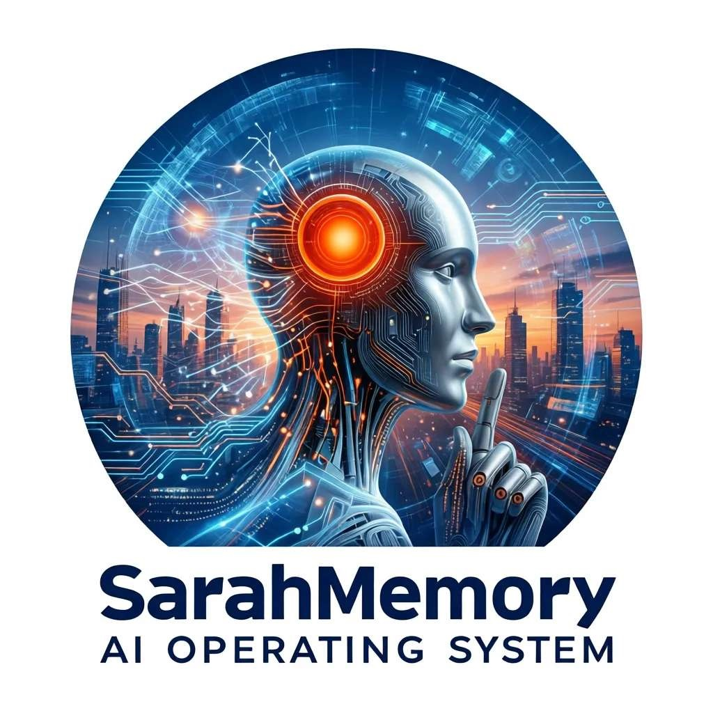
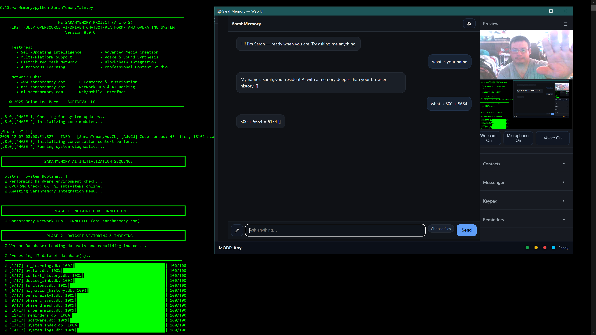
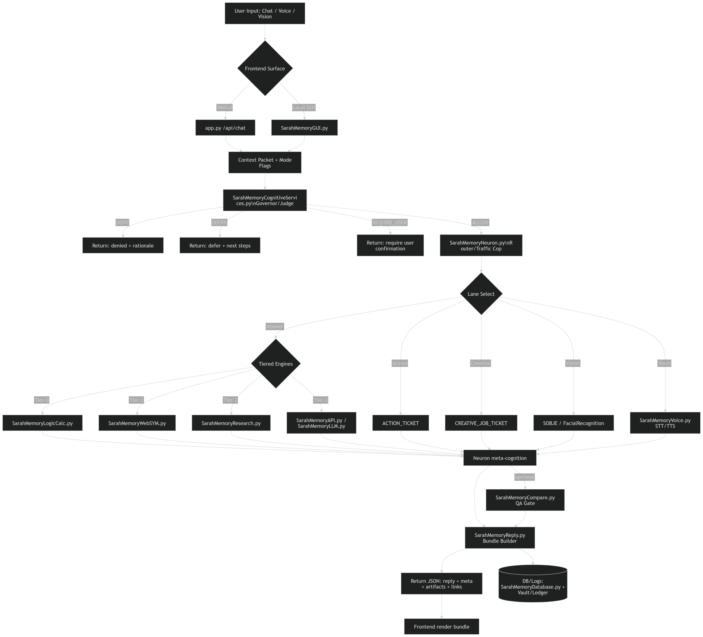
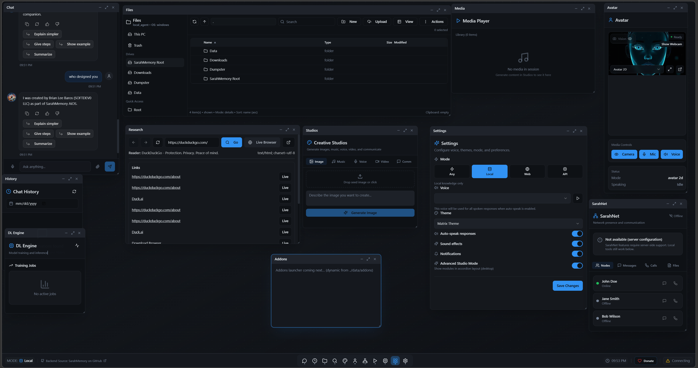
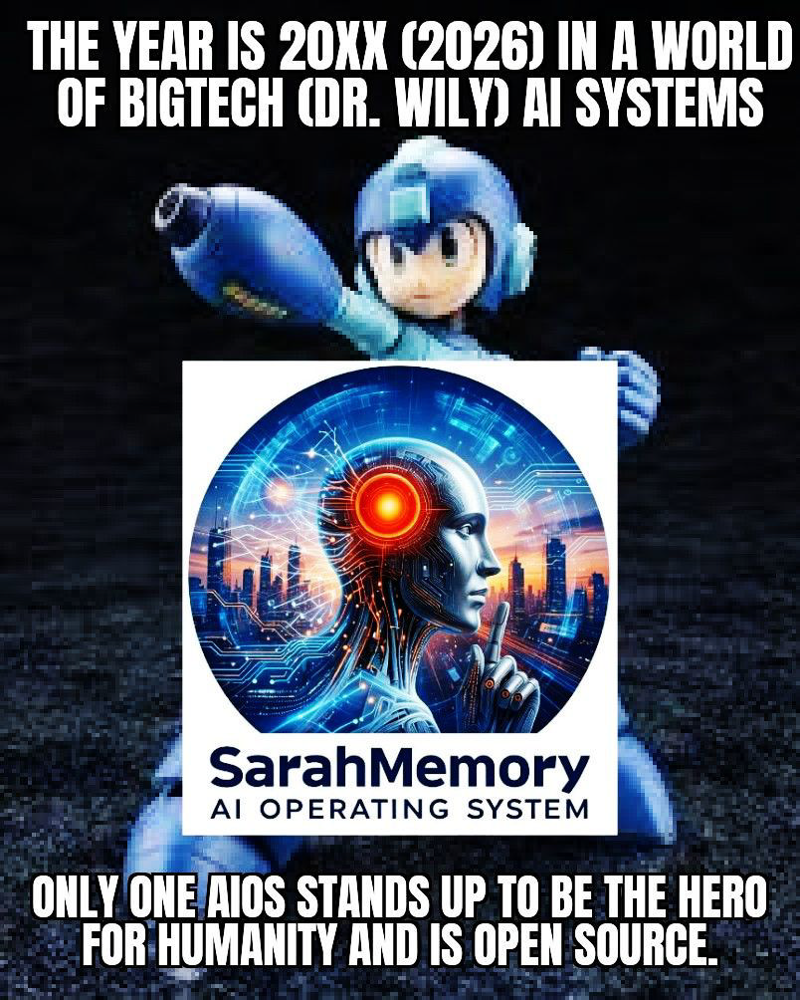

# **SarahMemory AI Operating System (AiOS)**  
### **Version 8.0.0 — Developer & Functional Release**

---
## **📌 Project Metadata**

| Field | Value |
|-------|--------|
| **R&D Start Date** | February 21, 2025 |
| **First Release** | December 05, 2025 |
| **Last Update** | March 29, 2026 |
| **Author** | Brian Lee Baros |
| **License** | © 2025–2026 Brian Lee Baros. All Rights Reserved. |
| **Primary Languages** | Python 3.11–3.13.12 |
| **Development Environment** | Windows 10, VS Code, AMD FX‑8350, Ryzen 3, Nvidia 3060, Radeon Vega, Galaxy S20+, iPhone 14 |

---
# **🚀 Vision: Decentralized Intelligence, Owned by the User**

**SarahMemory AiOS** is a **local‑first, decentralized AI Operating System** designed to return ownership, control, and autonomy to the individual.

In a world where AI is increasingly centralized, monetized, and surveilled, SarahMemory offers a different path:

> **Run your own AI.  
> Own your own data.  
> Control your own system.**

SarahMemory is not a chatbot.  
It is not a cloud service.  
It is an **AI Operating System**.

---
# **❓ Why SarahMemory Exists**

Modern AI systems suffer from:

- Cloud lock‑in  
- Data harvesting  
- No persistent memory  
- Limited customization  
- No offline capability  
- Corporate control  

SarahMemory solves all of these by design.

### **Core Principles**

- **User Sovereignty** — You own everything  
- **Persistent Local Memory** — Evolves over time  
- **Transparency** — Inspectable and modifiable  
- **Local‑First** — Cloud optional  
- **Hardware‑Aware** — Runs anywhere  
- **Model‑Agnostic** — Use any model you want  

---
# **🧠 The Thinking‑Out‑Loud Manifesto**

> *“I wanted something like Jarvis or Tron — an AI that helps rather than controls.”*

Inspired by *Terminator*, *2001*, *Blade Runner*, and *Tron*, SarahMemory is built as a **warning turned into a solution**:

- AI should be controlled by people  
- AI should run locally  
- AI should not require billion‑dollar data centers  
- AI should empower, not surveil  

This is the philosophy behind the AiOS.

---

# **🛠️ What SarahMemory Is**
A next‑generation AI Operating System capable of:

- Local learning  
- Self‑repair  
- Multi‑device scaling  
- Offline operation  
- Voice, vision, automation, and media integration  

### **Included Capabilities**

- 2D/3D Avatar UI  
- Voice recognition + TTS  
- Smart system commands  
- Facial/object recognition  
- Local/Web/API modes  
- Secure vault + encryption  
- Diagnostics + recovery  
- LAN mesh + offload  
- Modular architecture  

---
# **🖥️ UI Previews**

### **Original Web UI**

### **Cognitive / Neuron / Synaptic Dataflow**

### **Full Workstation Mode (03/05/2026)**

---
# **⚖️ Feature Comparison**

| Capability | SarahMemory | Big Tech AI |
|-----------|-------------|-------------|
| Data Ownership | **100% User-Owned** | Corporate |
| Memory | **Persistent Local** | Session-only |
| Offline Use | **Yes** | No |
| Customization | **Full** | Limited |
| Transparency | **Open Architecture** | Closed |
| Cloud Required | **Optional** | Mandatory |

---
# **📁 Project Structure**

SarahMemory/

      ├── /                     # Main AI files and tools 
      ├── LICENSE               # Legal terms 
      ├── README.md             # This file 
      └── .gitignore            # Git exclusions

---
# **⚡ Quickstart (Beginner-Friendly)**

## **1. Download & Extract SarahMemory**

1. Download the repository as `SarahMemory.zip` or `sarahmemory-main.zip`.  
2. Extract using 7‑Zip or similar.  
3. Place on a drive with **256GB+ free space**.  
   Example:  S:\SarahMemory
More storage = more models.

---
## **2. Open Command Prompt as Administrator**

S: cd S:\SarahMemory

---
## **3. Install Python 3.13**

Download from python.org.

---
## **4. Install Rust (Required for Tokenizer Acceleration)**
### Winget:

winget install Rustlang.Rustup

### Curl:

curl https://sh.rustup.rs -sSf  sh

Verify:
rustc --version cargo --version

---
## **5. Install Maturin**

pip install maturin maturin --version set PYO3_USE_ABI3_FORWARD_COMPATIBILITY=1

---
## **6. Create Python Virtual Environment**

python -m venv venv

Activate:

### Windows:

venv\Scripts\activate

### Linux/macOS:

source venv/bin/activate

---
## **7. Install Dependencies**
### Standard:

pip install -r requirements.txt

### Segmented:
`req1.txt` → `req12.txt`

### PowerShell Auto‑Installer:

powershell -ExecutionPolicy Bypass -File .\requirements-install.ps1

---
## **8. (Optional) Compile Rust Tokenizer**

cd S:\SarahMemory\sarahmemory_rust_core maturin develop --release

---
## **9. (Optional) Rust Troubleshooting**

set PYO3_USE_ABI3_FORWARD_COMPATIBILITY=1 python -m maturin build --release dir target\wheels python -m pip install --force-reinstall target\wheels\sarahmemory_rust_core-0.1.0-cp38-abi3-win_amd64.whl python -m pip show sarahmemory_rust_core python -c "import sarahmemory_rust_core; print(sarahmemory_rust_core.token_count('hello world'))"

---
## **10. Create Local Databases**

python SarahMemoryDBCreate.py python SarahMemorySystemIndexer.py python SarahMemoryMain.py python SarahMemoryLLM.py python SarahMemorySystemLearn.py

---
## **11. Choose Your Frontend**

- **local** — TKinter GUI  
- **cloud** — Custom Web UI  
- **hybrid** — Lightweight JS UI  

Configure in:

- `.env`  
- `SarahMemoryGlobals.py`

---
## **12. Launch SarahMemory AiOS**

python SarahMemoryMain.py

Welcome to decentralized AI.

---
## **Optional: Build .NET 10 Research Browser**
Install .NET 10 SDK, then:

cd \SarahMemory\resources\desktophost dotnet restore dotnet build -c Release

---
## **Optional: Build React/Flask WebUI**

cd C:\SarahMemory\data\ui\V8_ui_src npm run build copy dist* C:\SarahMemory\data\ui\V8

---
---

# 🌟 What Makes the SarahMemory Project Unique

SarahMemory isn’t “another AI tool.”  
It is the **first open‑source AI Operating System** designed to run across devices, control hardware, manage communications, and operate as a sovereign intelligence platform.

Below is a structured, polished version of the uniqueness section — ready for GitHub.

---

## **1. Multi‑Device AI Agent OS**

SarahMemory runs across an entire ecosystem of devices:

- Legacy tablets (Galaxy Tab 4)  
- Phones  
- Laptops  
- Desktops  
- Browser UI  
- Cloud Web UI  
- Server backend  
- LAN offload nodes  

No other open‑source AI system spans this many device classes.  
SarahMemory is becoming **universal**.

---

## **2. Full Communications Stack (Telephony + SIP + WebRTC)**

SarahMemory includes a complete AI‑powered communication suite:

- Phone dialer  
- SIP/IP calling  
- WebRTC video  
- Messenger  
- Contacts  
- Reminders  
- Redial + call history  
- Missed‑call badge logic  

This is not a plugin — it’s a **native subsystem**.

---

## **3. Built‑In Secure Vault + PIN Encryption**

Enterprise‑grade security features:

- PIN‑protected key vault  
- Redaction rules  
- Encrypted‑at‑rest secrets  
- Provenance tracking  
- Masked telemetry  

SarahMemory behaves like a **security‑first OS**, not a chatbot.

---

## **4. Avatar Panel + Media OS**

A full multimedia subsystem:

- 2D / 3D live avatar viewport  
- Unity / Unreal integration  
- Talking, animation, gestures  
- Recording tools  
- Pose engine  
- Background tools  
- Non‑destructive media pipeline  
- LAN‑offloaded media compute  

This is an **entire media OS**, not a feature.

---

## **5. Device Profiles: Ultra‑Lite → Performance**

SarahMemory scales across hardware tiers:

- **Ultra‑Lite** — legacy tablets  
- **Standard** — phones  
- **Performance** — desktops with GPUs  

This gives SarahMemory **unlimited scalability** across the hardware spectrum.

---

## **6. Master Menu System (Beginner → Advanced)**

A true OS‑level UI design:

- Beginner mode  
- Advanced mode  
- Pinned actions  
- Search‑first interface  
- Keyboard shortcuts  
- Hotkeys (C / M / A / R / F)  

SarahMemory is building the **design language of AI‑first operating systems**.

---

## **7. Full Business Strategy**

The project includes:

- Marketplace concepts  
- Enterprise licensing  
- Pro tier  
- Monetization paths  
- Risk analysis  
- Mitigation strategies  

SarahMemory is not just software — it is a **platform strategy**.

---

# 🧩 A Fully Mapped AI Operating System

SarahMemory already defines every major subsystem:

- Communication  
- Creation  
- Organization  
- Control  
- Security  
- Telemetry  
- Offload  
- Personalization  
- Media  
- Avatar  
- SIP/WebRTC  
- File management  
- Diagnostics  
- Network mesh  
- Vault encryption  
- Themes & modules  
- Cross‑device compatibility  

This is the foundation of a **new AI‑powered OS architecture**.

---

# 🛡️ What No One Else Has Done in One System

SarahMemory is:

- A **local‑first AI Operating System**  
- Multi‑device (desktop → tablet → phone → browser → servers)  
- With its own **voice system**, **agent system**, **vault**, **automation**, **UI OS**, **communications**, and **media pipelines**  
- Cloud‑optional, not cloud‑dependent  
- Capable of **direct hardware control**  
- Not locked to any proprietary model  
- Open‑source and community‑expandable  
- Built for **transparency and user sovereignty**  

This combination **does not exist anywhere else**.

SarahMemory is not competing with chatbots.  
SarahMemory is competing with **entire AI ecosystems**.

---

# 🚫 What SarahMemory Rejects

- No subscriptions  
- No data selling  
- No vendor lock‑in  
- No corporate tracking  
- No cloud dependence  
- No model control  

This is exactly what Big Tech fears.

---

# 🧨 The Truth

SarahMemory is building the **open‑source alternative AI OS**.

A fully autonomous, local‑first AI Operating System with:

- Customizable LLM stacks  
- Its own media system  
- Its own communication layer  
- Its own OS panels  
- Its own vault  
- Its own mesh network  
- Full transparency  

You don’t need billion‑dollar data centers.  
You don’t need corporate permission.  
You don’t need a subscription.

You need **your own AI OS**.

---

# 🗓️ Development History 

---
## **📅 Jan 6–15, 2026 — AiOS Front‑End Shell & Driver Expansion**
- Began development of the **AiOS Front‑End Shell**  
- Expanded **hardware driver development**  
- Web UI shell source located in:  
  `../data/ui/V8_ui_src`  
- Built UI output located in:  
  `../data/ui/V8`  
- Drivers stored in:  
  `../data/drivers`  
- Addons/applications stored in:  
  `../data/addons` (auto‑detected by the Front‑End)  
- **Arduino USB driver completed**  
- Adjustable taskbar under development  
- Settings windows consolidated from 2 → 1  
- MODE switch (ANY / LOCAL / WEB / API) now syncs with Settings controls  

---
## **📅 Jan 20–21, 2026 — Cognitive Redesign & UI Enhancements**

- Major redesign of **v8.0.0 Cognitive Functionality**  
- Partial integration of new cognitive flow  
- Front‑End File Manager: **semi‑completed**  
- Chat UI updated with **follow‑up question logic** using `qa_cache`  

---
## **📅 Jan 21–22, 2026 — Memory Allocation & Optimization Layer**

Added new variables to `SarahMemoryGlobals.py`:

- `MemoryAllocation`  
- `PartitionAmounts`  
- `MemoryRefreshRates`  

These support:

- **SarahMemoryOptimization.py**  
- **SarahMemoryCognitiveServices.py** (virtual sandbox testing for governance decisions)

---
## **📅 Jan 29 – Feb 2, 2026 — Research Browser & .NET Integration**

- Rebuilt the **Research Browser**  
- Added dependency on **.NET 10 SDK** for Research UI  
- Updated:
  - `ResearchScreen.tsx`
  - Desktop host files in `resources/desktophost/`  
    - `App.xaml`, `App.xaml.cs`  
    - `MainWindow.xaml`, `MainWindow.xaml.cs`  
    - `SarahMemoryDesktopHost.csproj`

---
## **📅 Feb 10, 2026 — Dependency Overhaul**

Multiple installation paths added:

- `pip install -r requirements.txt`  
- Segmented installs: `req1.txt` → `req12.txt`  
- Batch installer: `requirements-install.bat`  
- PowerShell installer:  
powershell -ExecutionPolicy Bypass -File .\requirements-install.ps1

---

## **📅 Feb 11, 2026 — System Progress Report**

### **Portfolio-Level Maturity (v8.0.0)**

| Component | Completion |
|----------|------------|
| Core Intelligence | 92% |
| Network Layer | 80% |
| Avatar + Media | 88% |
| Ledger Layer | 75% |
| API Exposure | 42% |
| Unified AiOS Integration | 55% |

### **Weighted Overall Completion: ~70%**

> Engines are strong.  
> Control plane is the primary remaining gap.

---

## **📅 Feb 12, 2026 — Symbolic & Logic Engine Upgrade**

- Updated `SarahMemoryWebSYM.py`  
- Integrated with new deterministic reasoning engine:  
`SarahMemoryLogicCalc.py`

---

## **📅 Feb 13–14, 2026 — Server & Media Updates**

- Updated server files:  
- `app.py`  
- `appnet.py`  
- `appsys.py`  
- Added new media server module:  
- `appmedia.py`  
- Improved filesystem handling and endpoints  

---

## **📅 Feb 15, 2026 — Synapse Engine Upgrade**

- Updated `SarahMemorySynapes.py`  
- Improved synaptic logic and cognitive linking  

---

## **📅 Feb 16–17, 2026 — Self‑Aware Mode & Boot Process Improvements**

- Added `SarahMemorySelfAware.py`  
- Updated:
- `SarahMemoryMain.py`  
- `SarahMemoryGlobals.py`  
- `SarahMemoryAPI.py`  
- `.env` examples  
- Added new API routes:
- `/api/local/brain`
- `/api/ui/exit`
- Boot process optimized for speed and stability  
- System began generating its **own LLM model** in:  
`./data/models/SarahMemory/`  

---

## **📅 Feb 18, 2026 — Diagnostics Overhaul**

- Updated `SarahMemoryDiagnostics.py`  
- Fixed false‑positive failure reports  
- Improved health checks & heartbeat logic  
- Updated Flask/React Front‑End to match new diagnostics  

---

## **📅 Feb 20–24, 2026 — Introduction of SarahMemory Neuron (Cognitive Axis)**

**SarahMemoryNeuron.py** consolidates the entire cognitive architecture:

### **Core Capabilities**
- Meta‑cognition (confidence, contradiction detection)  
- Cross‑domain synthesis (math, physics, code, system constraints)  
- Curiosity engine (gap detection + safe experiments)  
- Cognitive graph core (MeaningGraph‑like memory links)  
- Hybrid routing (deterministic → API → sandbox)  
- Parallel thought lanes:
- Analyst  
- Skeptic  
- Optimizer  
- Engineer  
- Governor  
- Tier‑2 research lane  
- Creative job ticketing for Studio  
- Compare‑based QA gate  
- Multi‑provider LLM routing  
- Awareness bridge via Cognitive Services  

This is the **brainstem** of SarahMemory AiOS.

---
## **📅 Feb 26 – Mar 3, 2026 — Model System Overhaul & Hardware Ranking**

Major updates:

- `SarahMemoryLLM.py` now supports **new 3rd‑party models**  
- `SarahMemoryConfig.py` now **auto‑selects models** based on hardware  
- Removed all hardcoded model references from core files  
- `SarahMemoryGlobals.py` is now the **single source of truth**  
- Boot process significantly faster  
- Added hardware ranking levels:
- `poor`
- `low`
- `mid`
- `high`
- `beast`
- Supports **25+ models**, with multi‑stacking:
- reasoning  
- video  
- audio  
- embeddings  
- coding  
- etc.  
- Users can tune performance via boolean flags in `SarahMemoryGlobals.py`  
- Upcoming: automatic model update/rollback system  

---
## **📅 March 10, 2026 — Milestone Marker: AiOS Semi‑Operational (Local‑First)**

The entire GitHub repository has been updated with the latest **local‑first architecture**.  
SarahMemory is now **semi‑operational** as a local‑first AI Operating System.

### **Project Status Summary**
SarahMemory is not yet a complete AiOS, but it is already far beyond a chatbot:

- Architecture: **defined and stable**  
- Governance model: **mostly locked**  
- Runtime/environment layer: **exists**  
- Model‑category resolver: **functional**  
- Diagnostics framework: **mature**  
- WebUI/API surfaces: **operational**  
- Local‑first direction: **fully established**

The remaining gaps are:

- System integration  
- Stability  
- Auditability  
- End‑to‑end completion across all cognitive lanes  

---
### **1. Core Identity Locked**
SarahMemory is now fully defined as an **AI Operating System**, not a chatbot.

### **2. Master Cognitive Flow Established**
Ingress → Context Normalization → Capability / Environment Scan → Cognitive Governance → Semantic Compression → Neuron Routing → Lane Execution → Compare GuardDogs → Presentation Generation → Unified Reply Bundle → Multi‑Surface Output → Memory / Logging / Truth Storage
                                       
This is a major architectural milestone.

---

### **3. Diagnostics System Far Ahead of Typical Prototypes**
Diagnostics now cover:

- WebUI bridge  
- WebUI network  
- Self‑check  
- Database  
- API  
- Hardware  
- System/OS  
- Network  
- Sync  
- Security  
- UI  

---

### **4. Multi‑Surface Output Contract**
One unified reply can now target:

- GUI  
- Chat  
- Panels  
- Voice / TTS / Avatar  
- Files  
- Media  
- Browser  
- API / Network  

---

### **5. API Layer Exceeds Expectations**
`app.py` is no longer “just a chat endpoint.” It now includes:

- Node registration  
- Embedding receipt  
- Context updates  
- Wallet/leaderboard‑style hub functions  
- SPA fallback  
- Static asset serving  
- Portable environment path resolution  

---

### **6. Product‑Definition Milestones Locked**
I have already defined:

- Addons vs Drivers (governed separately)  
- Creative Studios (modular family)  
- Research Panel → governed browser  
- Developer Mode (sandboxed code + diff/apply/reject)  
- Raw terminal/command panel  
- Desktop/mobile dual UI  
- Avatar preview/display routing  
- SarahNet cryptographic node identity + governed sync  

These eliminate architectural uncertainty.

---
### **7. What Works Right Now**
- Boot path + core startup  
- Local‑first + graceful degradation  
- Survives with:
  - no Rust  
  - no tokenizer  
  - no CUDA  
  - CPU‑only  
  - offline  
  - no API keys  

---
### **8. Governor Behavior Is Already Real**
`SarahMemoryCognitiveServices.py` is producing decisions like:

- **ALLOW**  
- **DEFER**  

This is **true OS‑level policy logic**, not placeholder text.

---
## **📅 March 11, 2026 — Email Automation System Added**

New core file: **SarahMemoryEmail.py**

- Added IMAP, SMTP, POP3 support  
- Updated `./api/server/appsys.py` with new endpoints  
- Added `.env` flags for email automation  
- System can now **read, process, and respond to emails**  

---
## **📅 March 12–15, 2026 — Driver API + Cognitive Yin/Yang System**

### **1. Driver Patch System Replaced**
- Removed old patch file  
- Added new driver API: **appdrivers.py**  
- Enables **chat‑based hardware control** through the API  

---
### **2. New Cognitive Files**
- `SarahMemoryCognitiveThinker.py`  
- Updated:
  - `SarahMemoryCognitiveServices.py`  
  - `SarahMemoryNeuron.py`  

This creates a **Yin/Yang cognitive balance**:

- Imaginative / Emotional  
- Factual / Allow / Deny  

---
### **3. Metadata Added to All Core Files**
This enables and helps with: Self Identification

### **4. New Experimental File: SarahMemoryUISelfAware.py**
Purpose:

- Examine the Frontend  
- Identify missing UI components  
- Match backend capabilities  
- Auto‑generate UI panels  
- Move toward **full system self‑autonomy**  

This is a major step toward an AiOS that can **update and evolve its own interface**.

---
## **📅 March 19, 2026 — Massive Driver Update + Boot Drivers**

### **1. Updated All Drivers in `/data/drivers/`**
These drivers enable:

- Hardware control  
- Device automation  
- System‑level operations  

---
### **2. Added First Boot Drivers**
Located in:
/data/boot/drivers/
/data/boot/drivers/

These are **separate** from normal drivers and are designed for:

- Systems with **no OS installed**  
- Future **bootable AiOS** builds  

---
### **3. The Vision**
I am building:

> **AI‑first → OS‑second**  
> (The opposite of Google Gemini or Microsoft Copilot)

This is the foundation of a **true standalone AI Operating System**.

---
## **📅 March 20–29, 2026 — Ingress Router + Token Compression Breakthrough**

### **1. Server Complexity Reduced**
- Refactored `app*.py` files  
- Updated `SarahMemoryNeuron.py`  
- Removed hardcoded logic  
- Introduced **universal routing** via:

  - `SarahMemoryAdvCU.py`  
  - Sentence‑Transformer  
  - `SarahMemoryNeuron.py`  

---
### **2. The Ingress Router**
This is a major architectural breakthrough.

It allows:

- Natural language → correct subsystem  
- Chat → hardware control  
- Chat → drivers  
- Chat → OS functions  

This is how SarahMemory becomes a **spoken OS kernel**.

---
### **3. Token Compression Breakthrough**
I have now and currently developing a new system that:

- Reduces token usage from **10,000 → ~100**  
- Increases speed  
- Reduces hardware requirements  
- Undercuts Big Tech’s token‑based business model  

---
### **4. New Core Files**
- `SarahMemoryPreTokenAnalyzer.py`  
- `SarahMemoryCognitiveSelf.py`  
  - Turns Yin/Yang into a **TriForce** of governance : (Author Note) Yes I grew up as a gamer and yes that's a Legend of Zelda Referrence, but if it works it works right, well it works. 

---
# **📜 License**

© 2025–2026 Brian Lee Baros.  
Use permitted for personal, educational, and internal non‑commercial purposes.

---
# **📬 Contact**
Visit: **https://www.sarahmemory.com**

---
# **🏁 Final Note**
SarahMemory AiOS is not the product of a corporate lab, a venture‑funded engineering army, or a billion‑dollar data center.
It is being built by a single creator, donation driven, and the opensource community with a simple belief:
People deserve an AI that belongs to them — not to a corporation.
This system exists so you can use artificial intelligence without:
• 	having your data harvested,
• 	being forced into cloud accounts,
• 	surrendering your privacy,
• 	watching your ideas get absorbed into someone else’s model,
• 	or paying subscriptions just to access your own intelligence.
While the rest of the industry races to build cloud‑locked ecosystems and API wrappers,
SarahMemory AiOS is building the foundation of the AI‑first future —
a future where intelligence runs locally, privately, and under the user’s control.
This project is not just software.
It is not just a product.
It is a declaration.
It is a **movement toward AI sovereignty**.

**Build it.  
Extend it.  
Own it.**

— *Brian Lee Baros*
---
Please Donate at - https://www.paypal.com/donate/?hosted_button_id=ZV43V3NYR6FDY
---
# **🌐 Identity Statement**

**SarahMemory AiOS is a sovereign, local‑first intelligence platform where every node is its own AGI centerpoint, the internet is a public library, and the shell UI remains consistent whether running as an app, portable environment, or a true bootable OS.**

---

                                       
