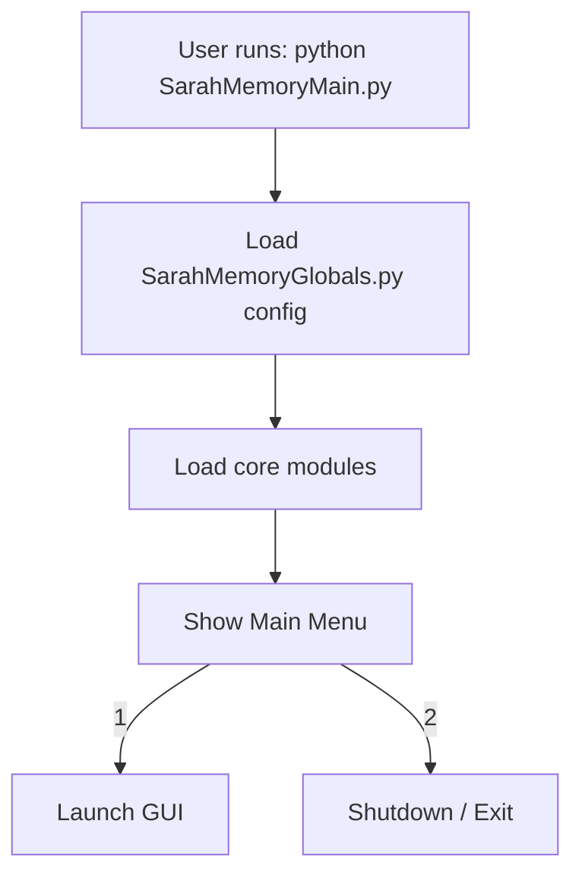

# Bootup Sequence

**Notes:**

- Main does not appear to call DB initialization early; ensure DBs exist before diagnostics/personality subsystems read them.
- Could not statically detect a GUI launcher symbol in SarahMemoryMain.py; verify the menu option triggers SarahMemoryGUI.py correctly.
