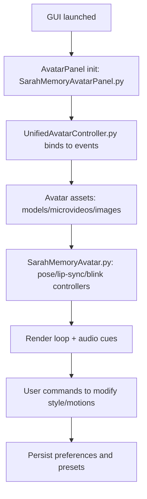

# Avatar Pipeline

```mermaid
flowchart TD
    A[GUI launched] --> B[AvatarPanel init: SarahMemoryAvatarPanel.py]
    B --> C[UnifiedAvatarController.py binds to events]
    C --> D[Avatar assets: models/microvideos/images]
    D --> E[SarahMemoryAvatar.py: pose/lip-sync/blink controllers]
    E --> F[Render loop + audio cues]
    F --> G[User commands to modify style/motions]
    G --> H[Persist preferences and presets]
```
