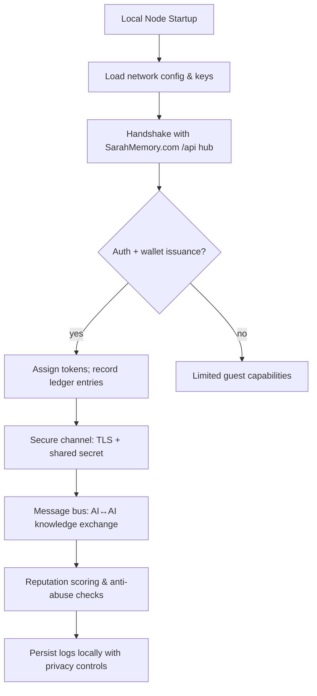

# Network/Mesh Flow

```mermaid
flowchart TD
    A[Local Node Startup] --> B[Load network config & keys]
    B --> C[Handshake with SarahMemory.com /api hub]
    C --> D{Auth + wallet issuance?}
    D -->|yes| E[Assign tokens; record ledger entries]
    D -->|no| F[Limited guest capabilities]
    E --> G[Secure channel: TLS + shared secret]
    G --> H[Message bus: AI↔AI knowledge exchange]
    H --> I[Reputation scoring & anti-abuse checks]
    I --> J[Persist logs locally with privacy controls]
```
