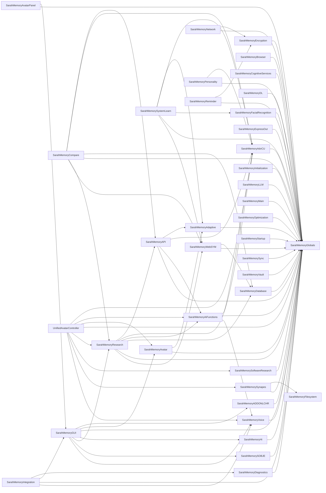

# Module Interaction Graph

```mermaid
flowchart LR
    %% Module interaction graph (imports)
    SarahMemoryADDONLCHR --> SarahMemoryGlobals
    SarahMemoryAPI --> SarahMemoryAdaptive
    SarahMemoryAPI --> SarahMemoryAdvCU
    SarahMemoryAPI --> SarahMemoryAiFunctions
    SarahMemoryAPI --> SarahMemoryGlobals
    SarahMemoryAdaptive --> SarahMemoryGlobals
    SarahMemoryAdvCU --> SarahMemoryGlobals
    SarahMemoryAiFunctions --> SarahMemoryAdvCU
    SarahMemoryAiFunctions --> SarahMemoryGlobals
    SarahMemoryAiFunctions --> SarahMemoryVoice
    SarahMemoryAvatar --> SarahMemoryAdaptive
    SarahMemoryAvatar --> SarahMemoryGlobals
    SarahMemoryAvatarPanel --> SarahMemoryGUI
    SarahMemoryAvatarPanel --> SarahMemoryGlobals
    SarahMemoryBrowser --> SarahMemoryGlobals
    SarahMemoryCognitiveServices --> SarahMemoryGlobals
    SarahMemoryCompare --> SarahMemoryAPI
    SarahMemoryCompare --> SarahMemoryAdvCU
    SarahMemoryCompare --> SarahMemoryDatabase
    SarahMemoryCompare --> SarahMemoryGlobals
    SarahMemoryCompare --> SarahMemoryResearch
    SarahMemoryCompare --> SarahMemoryWebSYM
    SarahMemoryDL --> SarahMemoryGlobals
    SarahMemoryDatabase --> SarahMemoryGlobals
    SarahMemoryDiagnostics --> SarahMemoryGlobals
    SarahMemoryEncryption --> SarahMemoryGlobals
    SarahMemoryExpressOut --> SarahMemoryGlobals
    SarahMemoryFacialRecognition --> SarahMemoryGlobals
    SarahMemoryGUI --> SarahMemoryADDONLCHR
    SarahMemoryGUI --> SarahMemoryAvatar
    SarahMemoryGUI --> SarahMemoryGlobals
    SarahMemoryGUI --> SarahMemoryHi
    SarahMemoryGUI --> SarahMemoryResearch
    SarahMemoryGUI --> SarahMemorySOBJE
    SarahMemoryGUI --> SarahMemoryVoice
    SarahMemoryHi --> SarahMemoryGlobals
    SarahMemoryInitialization --> SarahMemoryGlobals
    SarahMemoryIntegration --> SarahMemoryDiagnostics
    SarahMemoryIntegration --> SarahMemoryGUI
    SarahMemoryIntegration --> SarahMemoryGlobals
    SarahMemoryIntegration --> SarahMemoryVoice
    SarahMemoryLLM --> SarahMemoryGlobals
    SarahMemoryMain --> SarahMemoryGlobals
    SarahMemoryNetwork --> SarahMemoryEncryption
    SarahMemoryNetwork --> SarahMemoryGlobals
    SarahMemoryOptimization --> SarahMemoryGlobals
    SarahMemoryPersonality --> SarahMemoryAdvCU
    SarahMemoryPersonality --> SarahMemoryGlobals
    SarahMemoryReminder --> SarahMemoryEncryption
    SarahMemoryReminder --> SarahMemoryGlobals
    SarahMemoryResearch --> SarahMemoryAPI
    SarahMemoryResearch --> SarahMemoryAdvCU
    SarahMemoryResearch --> SarahMemoryAiFunctions
    SarahMemoryResearch --> SarahMemoryDatabase
    SarahMemoryResearch --> SarahMemoryGlobals
    SarahMemoryResearch --> SarahMemoryWebSYM
    SarahMemorySOBJE --> SarahMemoryGlobals
    SarahMemorySoftwareResearch --> SarahMemoryGlobals
    SarahMemoryStartup --> SarahMemoryGlobals
    SarahMemorySynapes --> SarahMemoryFilesystem
    SarahMemorySynapes --> SarahMemoryGlobals
    SarahMemorySync --> SarahMemoryGlobals
    SarahMemorySystemLearn --> SarahMemoryAdaptive
    SarahMemorySystemLearn --> SarahMemoryAdvCU
    SarahMemorySystemLearn --> SarahMemoryFacialRecognition
    SarahMemorySystemLearn --> SarahMemoryGlobals
    SarahMemorySystemLearn --> SarahMemoryWebSYM
    SarahMemoryVault --> SarahMemoryGlobals
    SarahMemoryVoice --> SarahMemoryGlobals
    SarahMemoryWebSYM --> SarahMemoryDatabase
    SarahMemoryWebSYM --> SarahMemoryGlobals
    UnifiedAvatarController --> SarahMemoryAdvCU
    UnifiedAvatarController --> SarahMemoryAiFunctions
    UnifiedAvatarController --> SarahMemoryAvatar
    UnifiedAvatarController --> SarahMemoryGlobals
    UnifiedAvatarController --> SarahMemoryResearch
    UnifiedAvatarController --> SarahMemorySoftwareResearch
    UnifiedAvatarController --> SarahMemorySynapes
    UnifiedAvatarController --> SarahMemoryVoice
```
