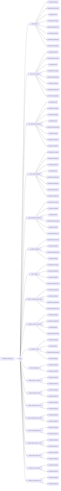

# Globals → Flags → Modules (Top 20 by usage)

```mermaid
flowchart LR
    A[SarahMemoryGlobals.py] --> B{Flags}
    B --> F1[SAFE_MODE]
    F1 --> F1_1(SarahMemoryAdvCU)
    F1 --> F1_2(SarahMemoryAiFunctions)
    F1 --> F1_3(SarahMemoryAPI)
    F1 --> F1_4(SarahMemoryCompare)
    F1 --> F1_5(SarahMemoryDiagnostics)
    F1 --> F1_6(SarahMemoryGlobals)
    F1 --> F1_7(SarahMemoryInitialization)
    F1 --> F1_8(SarahMemoryIntegration)
    B --> F2[LOCAL_ONLY_MODE]
    F2 --> F2_1(SarahMemoryAdvCU)
    F2 --> F2_2(SarahMemoryAiFunctions)
    F2 --> F2_3(SarahMemoryAPI)
    F2 --> F2_4(SarahMemoryCompare)
    F2 --> F2_5(SarahMemoryDiagnostics)
    F2 --> F2_6(SarahMemoryGlobals)
    F2 --> F2_7(SarahMemoryInitialization)
    F2 --> F2_8(SarahMemoryIntegration)
    B --> F3[API_RESEARCH_ENABLED]
    F3 --> F3_1(SarahMemoryAPI)
    F3 --> F3_2(SarahMemoryCompare)
    F3 --> F3_3(SarahMemoryGlobals)
    F3 --> F3_4(SarahMemoryGUI)
    F3 --> F3_5(SarahMemoryReply.backup)
    F3 --> F3_6(SarahMemoryReply)
    F3 --> F3_7(SarahMemoryResearch)
    F3 --> F3_8(SarahMemoryUpdater)
    B --> F4[LOCAL_DATA_ENABLED]
    F4 --> F4_1(SarahMemoryCompare)
    F4 --> F4_2(SarahMemoryDatabase)
    F4 --> F4_3(SarahMemoryGlobals)
    F4 --> F4_4(SarahMemoryGUI)
    F4 --> F4_5(SarahMemoryInitialization)
    F4 --> F4_6(SarahMemoryIntegration)
    F4 --> F4_7(SarahMemoryResearch)
    F4 --> F4_8(SarahMemoryWebSYM)
    B --> F5[WEB_RESEARCH_ENABLED]
    F5 --> F5_1(SarahMemoryCompare)
    F5 --> F5_2(SarahMemoryGlobals)
    F5 --> F5_3(SarahMemoryGUI)
    F5 --> F5_4(SarahMemoryReply.backup)
    F5 --> F5_5(SarahMemoryReply)
    F5 --> F5_6(SarahMemoryResearch)
    B --> F6[AI_AGENT_ENABLED]
    F6 --> F6_1(SarahMemoryAiFunctions)
    F6 --> F6_2(SarahMemoryGlobals)
    F6 --> F6_3(SarahMemoryReply.backup)
    F6 --> F6_4(SarahMemoryReply)
    B --> F7[MULTI_MODEL]
    F7 --> F7_1(SarahMemoryCompare)
    F7 --> F7_2(SarahMemoryDatabase)
    F7 --> F7_3(SarahMemoryGlobals)
    F7 --> F7_4(SarahMemorySystemLearn)
    B --> F8[IMPORT_OTHER_DATA_LEARN]
    F8 --> F8_1(SarahMemoryDatabase)
    F8 --> F8_2(SarahMemoryGlobals)
    F8 --> F8_3(SarahMemoryInitialization)
    F8 --> F8_4(SarahMemorySystemLearn)
    B --> F9[ENABLE_CONTEXT_BUFFER]
    F9 --> F9_1(SarahMemoryGlobals)
    F9 --> F9_2(SarahMemoryIntegration)
    F9 --> F9_3(SarahMemoryMain)
    F9 --> F9_4(SarahMemoryPersonality)
    B --> F10[INTERRUPT_FLAG]
    F10 --> F10_1(SarahMemoryGlobals)
    F10 --> F10_2(SarahMemoryGUI)
    F10 --> F10_3(SarahMemoryReply.backup)
    F10 --> F10_4(SarahMemoryReply)
    B --> F11[SARAH_WEB_BASE]
    F11 --> F11_1(SarahMemoryGlobals)
    F11 --> F11_2(SarahMemoryNetwork)
    B --> F12[SARAH_WEB_API_PREFIX]
    F12 --> F12_1(SarahMemoryGlobals)
    F12 --> F12_2(SarahMemoryNetwork)
    B --> F13[SARAH_WEB_PING_PATH]
    F13 --> F13_1(SarahMemoryGlobals)
    F13 --> F13_2(SarahMemoryNetwork)
    B --> F14[SARAH_WEB_HEALTH_PATH]
    F14 --> F14_1(SarahMemoryGlobals)
    F14 --> F14_2(SarahMemoryNetwork)
    B --> F15[SARAH_WEB_REGISTER_PATH]
    F15 --> F15_1(SarahMemoryGlobals)
    F15 --> F15_2(SarahMemoryNetwork)
    B --> F16[SARAH_WEB_EMBED_PATH]
    F16 --> F16_1(SarahMemoryGlobals)
    F16 --> F16_2(SarahMemoryNetwork)
    B --> F17[SARAH_WEB_CONTEXT_PATH]
    F17 --> F17_1(SarahMemoryGlobals)
    F17 --> F17_2(SarahMemoryNetwork)
    B --> F18[SARAH_WEB_JOBS_PATH]
    F18 --> F18_1(SarahMemoryGlobals)
    F18 --> F18_2(SarahMemoryNetwork)
    B --> F19[REMOTE_HTTP_TIMEOUT]
    F19 --> F19_1(SarahMemoryGlobals)
    F19 --> F19_2(SarahMemoryNetwork)
    B --> F20[REMOTE_HEARTBEAT_SEC]
    F20 --> F20_1(SarahMemoryGlobals)
    F20 --> F20_2(SarahMemoryNetwork)
```
